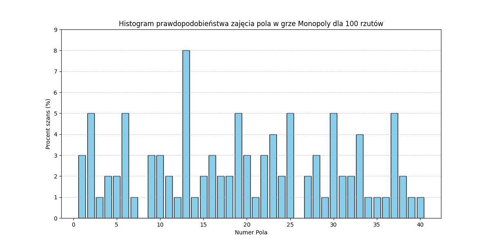
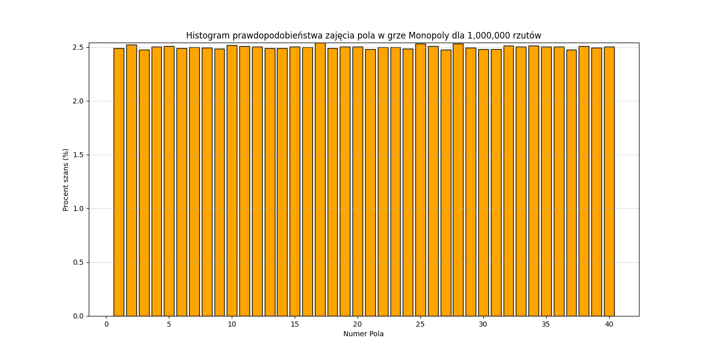
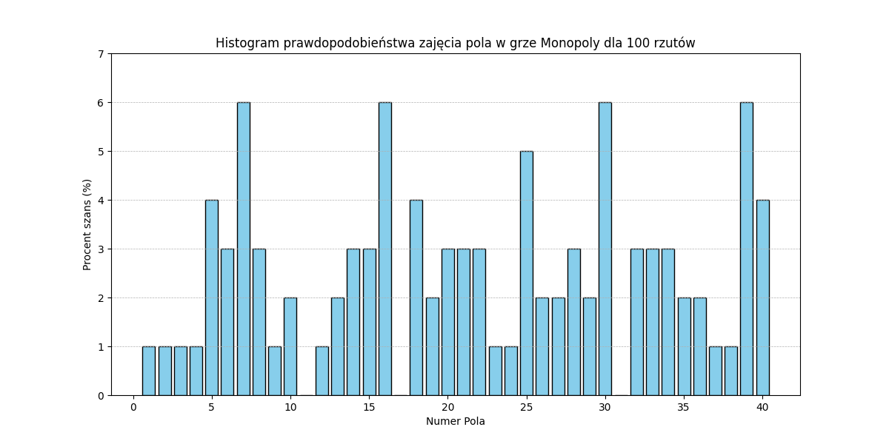
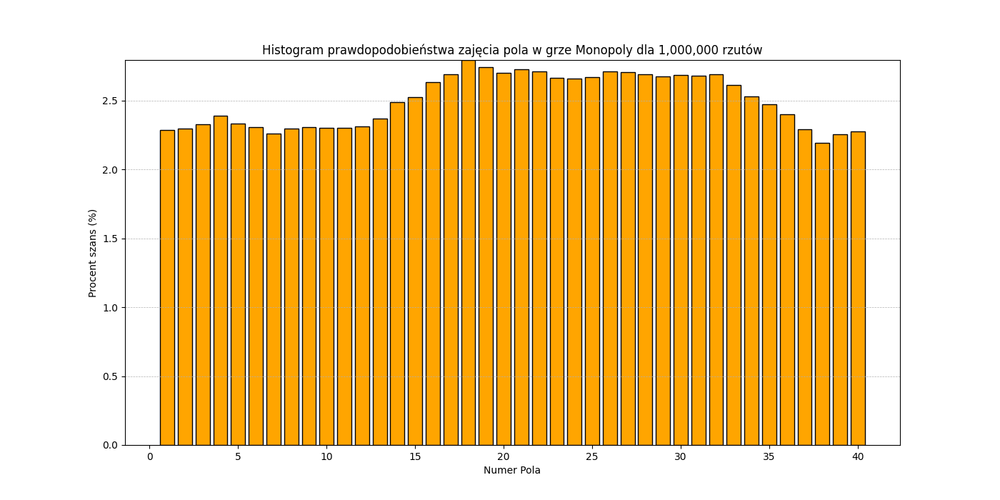

# Sprawozdanie z listy 0 - Monopoly

# Mateusz Wojteczek

## Wstęp

W ramach niniejszej pracy projektowałem i napisałem program komputerowy modelujący grę w Monopoly jako losowy ruch jednowymiarowy na cyklicznej planszy składającej się z 40 pól. Symulacja skupia się na pojedynczym graczu poruszającym się po planszy na podstawie sumy oczek wyrzuconych na dwóch sześciennych kostkach. Celem badania jest analiza rozkładu prawdopodobieństa p(i) zajęcia przez gracza i-tego pola na planszy w dwóch różnych scenariuszach: standardowym ruchu po planszy oraz ruchu z uwzględnieniem specjalnego pola "idziesz do więzienia", które przenosi gracza na pole 10, przy czym należy wspomnieć, że w przypadku wejścia na pole 30 (polu "idziesz do więzienia"), zwiększam liczbę odwiedzin na owym polu oraz na polu 10 ("więzienie"). Analizę przeprowadziłem dla dwóch różnych liczb rzutów kostkami: 100 oraz 1 000 000, aby zbadać zachowanie rozkładu w krótkim i długim horyzoncie czasowym. Wyniki przedstawiam w formie wykresów, oferując wgląd w dynamikę i strategie gry w Monopol z perspektywy teorii prawdopodobieństwa.

## Kod programu
### Wersja bez reguły "idziesz do więzienia"

```cpp

#include <iostream>
#include <cstdlib>
#include <ctime>
#include <fstream>

int main() {
    int plansza[40] = { 0 }; 
    int pozycja_gracza = 0; 

    srand(time(NULL)); 

    int n_rz; // Liczba rzutów kostkami.
    std::cout << "Ile rzutow koscmi?" << std::endl;
    std::cin >> n_rz; 

    for (int i = 0; i < n_rz; i++) {
        int kostka1 = rand() % 6 + 1; 
        int kostka2 = rand() % 6 + 1; 

        int suma = kostka1 + kostka2; 
        pozycja_gracza = (pozycja_gracza + suma) % 40; // Aktualizacja pozycji gracza na planszy z uwzględnieniem cykliczności planszy.

        plansza[pozycja_gracza] += 1; 
    }

    std::ofstream outfile("output_no_jail.txt"); 

    for (int j = 0; j < 40; j++) {
        double procent = (double)plansza[j] / n_rz * 100; // Obliczenie procentowej szansy wizyty na polu.
        outfile << "Pole " << j + 1 << ": " << plansza[j] << " (" << procent << "%)" << std::endl; // Zapis do pliku.
    }

    outfile.close(); 

    return 0;
}
```

### Wersja z regułą "idziesz do więzienia"

```cpp
#include <iostream>
#include <cstdlib>
#include <ctime>
#include <fstream>

int main() {
    int plansza[40] = { 0 }; 
    int pozycja_gracza = 0; 

    srand(time(NULL)); 
    int n_rz; // Liczba rzutów kostkami.
    std::cout << "Ile rzutow koscmi?" << std::endl;
    std::cin >> n_rz; 

    for (int i = 0; i < n_rz; i++) {
        int kostka1 = rand() % 6 + 1; 
        int kostka2 = rand() % 6 + 1; 
        int suma = kostka1 + kostka2; 

        if ((pozycja_gracza + suma) < 40) {
            pozycja_gracza += suma; // Aktualizacja pozycji gracza, jeśli nie przekroczył końca planszy.
        } else {
            pozycja_gracza = (pozycja_gracza + suma) % 40; // Powrót na początek planszy po przekroczeniu 40 pól.
        }

        if (pozycja_gracza == 30) { // Sprawdzenie, czy gracz trafił na pole "Idziesz do więzienia".
            plansza[pozycja_gracza] += 1; // Zwiększenie licznika wizyt na polu "Idziesz do więzienia".
            pozycja_gracza = 10; // Przesunięcie gracza do więzienia.
        } else {
            plansza[pozycja_gracza] += 1; 
        }
    }

    std::ofstream outfile("output_with_jail.txt"); 

    for (int j = 0; j < 40; j++) {
        double procent = (double)plansza[j] / n_rz * 100; // Obliczenie procentowej szansy wizyty na polu.
        outfile << "Pole " << j + 1 << ": " << plansza[j] << " (" << procent << "%)" << std::endl; 
    }

    outfile.close(); 

    return 0;
}
```
### Skrypt Pythona do generowania wykresów

```python

import matplotlib.pyplot as plt

# Dane wejściowe
numery_pol = list(range(1, 41))  # numery pól od 1 do 40

procent_szans = [
    3, 5, 1, 2, 2, 5, 1, 0, 3, 3,
    2, 1, 8, 1, 2, 3, 2, 2, 5, 3,
    1, 3, 4, 2, 5, 0, 2, 3, 1, 5,
    2, 2, 4, 1, 1, 1, 5, 2, 1, 1
]

# Utworzenie histogramu
plt.figure(figsize=(12, 6))
plt.bar(numery_pol, procent_szans, color='skyblue', edgecolor='black')

# Dodanie etykiet i tytułu
plt.title('Histogram prawdopodobieństwa zajęcia pola w grze Monopoly dla 100 rzutów')
plt.xlabel('Numer Pola')
plt.ylabel('Procent szans (%)')

# Ustawienie zakresu osi y
plt.ylim(0, max(procent_szans) + 1)

# Wyświetlenie siatki
plt.grid(axis='y', linestyle='--', linewidth=0.5)

# Zapisanie wykresu do pliku
output_file = f'C:/Users/Administrator/Desktop/monopoly_histogram_100_rolls.png'
plt.savefig(output_file)

# Pokazanie wykresu
plt.show()
```

## Analiza wyników

### Wersja bez więzienia



W przypadku podjęcia próby analizy wykresu sporządzonego dla 100 rzutów kostkami w wersji bez więzienia, a więc bez dodatkowego wpływu sztucznego zwiększenia liczby wizyt na polu 10, możemy zauważyć, że wyróżnia się tak naprawdę jedno pole (pole numer 13), które ma znacznie wyższy procent szans niż cała reszta, jednakże równocześnie istnieją pola, które nie zostały odwiedzone ani razu, więc możemy zdecydowanie stwierdzić, że taka wielkość próby nie jest wystarczająca do wyciągnięcia jednoznacznych wniosków. 



W przypadku odpowiednio wielkiej próby, możemy zauważyć, że szanse na wejście na dane pole wyrównują się i nie ma żadnego faworyzowanego pola w tej grze, wszystkie wartości pozostają w okolicach 2%.

### Wersja z więzieniem



W powyższym przypadku z zaimplementowaną regułą więzienia, nadal widzimy, że taka próba nie jest wystarczająca do wyciągnięcia jakichkolwiek wniosków ze względu na duży rozrzut wyników oraz na niektóre pola, które nie miały w ogóle odwiedzin.



W tym przypadku, wraz z implementacją zasady "Idziesz do więzienia", mozemy nadal zauważyć, że szanse się wyrównują, jednakże mamy pewne odstępstwa w okolicach pola 10 oraz 30 (pola 15 - 36), gdzie szanse są odpowiednio większe od reszty pól, wykraczając poza normę. Może to być związane z implementacją reguły w kodzie.

## Wnioski
Przede wszystkim, należy przyjąć, że bez odpowiedniej wielkości próby, nie ma sensu podejmować się analizy takiego problemu. Natomiast analizując histogram prawdopodobieństwa dla próby 1000000 rzutów kostką, możemy zauważyć, że nie ma sensu tworzenie strategii do gry w Monopoly ze względu na praktycznie równą szansę stanięcia na jakiekolwiek pole na planszy. 


