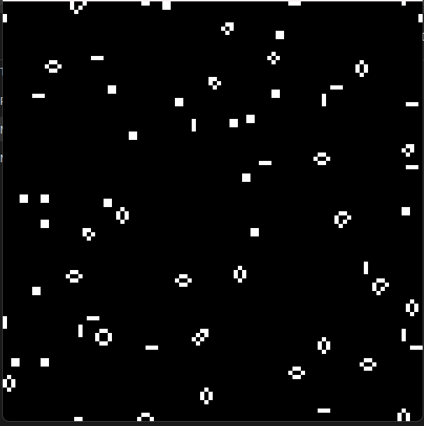
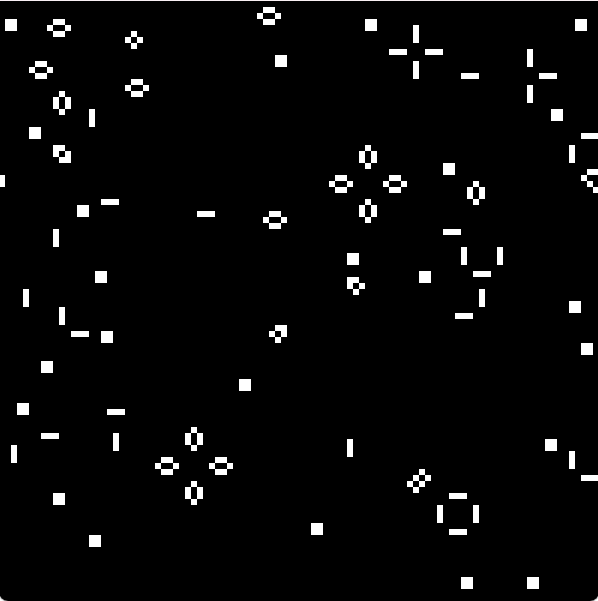
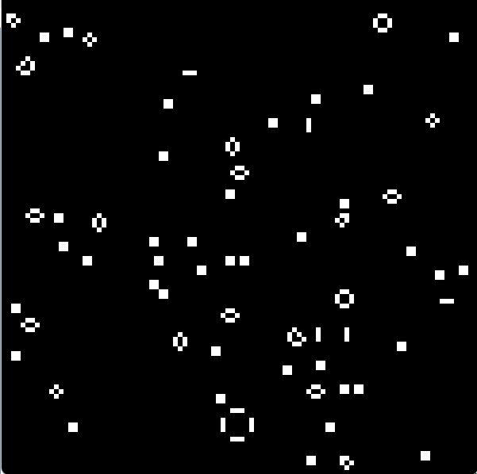
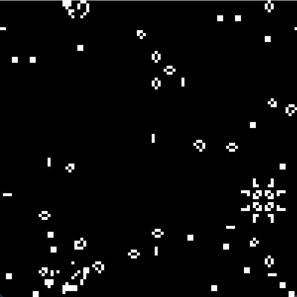
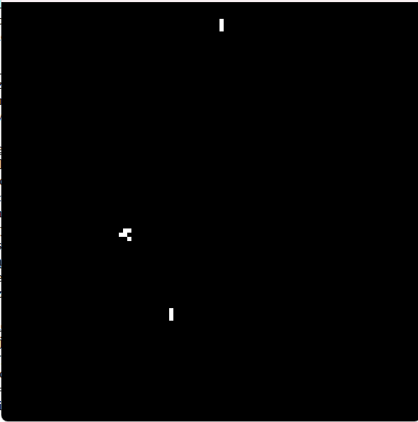
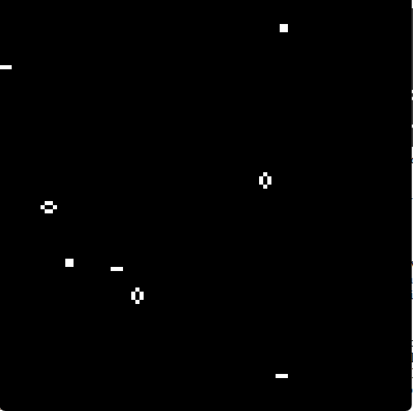
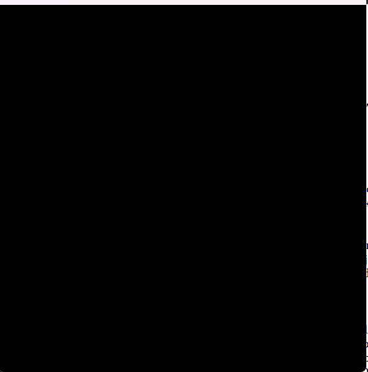
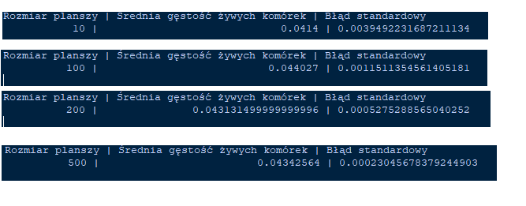

# Sprawozdanie z listy 2 - Game of Life

# Mateusz Wojteczek


## Wstęp

Celem tej pracy było zaprojektowanie i stworzenie programu komputerowego symulującego Game of Life wedle Conway'a, która jest szczególnym przypadkiem automatu komórkowego. Gra w Życie działa na zasadzie prostej symulacji, w której każda komórka na dwuwymiarowej siatce może znajdować się w jednym z dwóch stanów: aktywnym (żywa) lub nieaktywnym (martwa).
Stan komórki w następnym kroku czasowym zależy od liczby jej aktywnych sąsiadów. Celem symulacji jest obserwacja ewolucji układu początkowego, który jest generowany losowo z określonym prawdopodobieństwem początkowej aktywacji komórek p0.


## Kod programu

```python
import pygame  
import numpy as np  
import matplotlib.pyplot as plt  

# Ustawienia parametrów wyświetlania
width, height = 600, 600  # Definicja szerokości i wysokości okna Pygame
rows, cols = 100, 100  # Definicja liczby wierszy i kolumn w siatce automatu komórkowego
cell_size = width // cols, height // rows  # Obliczenie rozmiaru każdej komórki w siatce
black = (0, 0, 0)  
white = (255, 255, 255)  

# Inicjalizacja Pygame i okna wyświetlania
pygame.init()  
screen = pygame.display.set_mode((width, height))  
pygame.display.set_caption("Game of Life")  

def create_grid(p0=0.1):
    """Tworzenie nowej siatki z losowymi stanami początkowymi oraz z zadanym prawdopodobieństwem p0."""
    return np.random.choice([0, 1], size=(rows, cols), p=[1-p0, p0])


def draw_grid(current_grid, prev_grid):
    """Rysowanie siatki, optymalizacja poprzez przerysowywanie tylko zmienionych komórek."""
    for row in range(rows):
        for col in range(cols):
            # Sprawdzanie, czy stan bieżącej komórki zmienił się w porównaniu do poprzedniego stanu
            if current_grid[row][col] != prev_grid[row][col]:
                # Ustawianie koloru w zależności od bieżącego stanu komórki (aktywna lub nieaktywna)
                color = white if current_grid[row][col] == 1 else black
                # Rysowanie komórki jako prostokąta na ekranie Pygame w określonym kolorze
                pygame.draw.rect(screen, color, (col * cell_size[0], row * cell_size[1], cell_size[0], cell_size[1]))

def update_grid(grid):
    """Aktualizacja siatki na podstawie reguł automatu komórkowego."""
    new_grid = grid.copy()  # Tworzenie kopii bieżącej siatki do przechowywania nowych stanów
    for row in range(rows):
        for col in range(cols):
            # Obliczanie całkowitej liczby aktywnych sąsiadów wokół bieżącej komórki (bez aktualnej komórki)
            total = sum([grid[(row + i) % rows][(col + j) % cols] for i in range(-1, 2) for j in range(-1, 2)]) - grid[row][col]
            
            # Stosowanie reguł automatu komórkowego do określenia następnego stanu komórki
            if grid[row][col] == 1:  # Jeśli komórka jest obecnie aktywna
                # Komórka staje się nieaktywna, jeśli ma mniej niż 2 lub więcej niż 3 aktywnych sąsiadów (przeludnienie lub osamotnienie)
                if total < 2 or total > 3:
                    new_grid[row][col] = 0
            else:  
                # Komórka staje się aktywna, jeśli ma dokładnie 3 aktywnych sąsiadów (rozmnażanie)
                if total == 3:
                    new_grid[row][col] = 1

    return new_grid  

def main():
    current_grid = create_grid(0.5)  # Inicjowanie siatki losowymi stanami
    prev_grid = np.zeros((rows, cols))  # Inicjowanie poprzedniego stanu siatki dla porównania (początkowo same zera)
    running = True  

    # Ustawienie wykresu dystrybucji gęstości za pomocą Matplotlib
    plt.ion()  # Włączenie trybu interaktywnego rysowania
    fig, ax = plt.subplots()  
    ax.set_title('Rozkład gęstości w czasie')  # Ustawienie tytułu wykresu
    ax.set_xlabel('Iteracja')  
    ax.set_ylabel('Gęstość')  
    densities = []  # Inicjowanie listy do przechowywania wartości gęstości w czasie
    
    iteration = 0  # Inicjowanie licznika iteracji

    while running:  
        for event in pygame.event.get():  
            if event.type == pygame.QUIT:  
                running = False  

        draw_grid(current_grid, prev_grid)  # Rysowanie bieżącego stanu siatki
        pygame.display.flip()  # Aktualizacja wyświetlania Pygame, aby pokazać nowe rysowanie
        
        # Aktualizacja siatki i zapisanie poprzedniego stanu do porównania w następnej iteracji
        prev_grid = current_grid.copy()
        current_grid = update_grid(current_grid)

        # Obliczanie i rysowanie gęstości aktywnych komórek w siatce
        density = np.mean(current_grid)  # Obliczanie średniej wartości siatki (gęstość aktywnych komórek)
        densities.append(density)  # Dodawanie gęstości do listy
        if iteration % 10 == 0:  # Aktualizacja wykresu co 10 iteracji dla efektywności
            ax.clear()  # Czyszczenie poprzedniego wykresu
            ax.plot(densities)  # Rysowanie nowych wartości gęstości
            ax.set_title('Rozkład gęstości w czasie', fontsize = 16)  # Resetowanie tytułu (usuniętego przez ax.clear())
            ax.set_xlabel('Iteracja', fontsize = 12)  # Resetowanie etykiety osi X
            ax.set_ylabel('Gęstość', fontsize = 12)  # Resetowanie etykiety osi Y
            plt.pause(0.01)  # Krótka pauza, aby zaktualizować wykres

        iteration += 1  # Inkrementacja licznika iteracji

    pygame.quit()  
    plt.ioff()  
    plt.show()  # Pokazanie ostatecznego wykresu gęstości

if __name__ == "__main__":
    main()  
```


## Analiza wyników - proponowane p0.
### Rozkład gęstości od czasu dla p0 równego 10%


### Wynik działania symulacji


Dla prawdopodobieństwa równego 10% występowały pewne wahania rozkładu gęstości, był on dość niestabilny jednakże po t > 1000 dążył do stabilizacji.

### Rozkład gęstości od czasu dla p0 równego 30%


### Wynik działania symulacji


Tutaj możemy zauważyć nagły spadek gęstości po pierwszych okolo 100 iteracjach, oraz względną stabilność wraz z dążeniem do wygaszenia układu po t > 1000.

### Rozkład gęstości od czasu dla p0 równego 60%


### Wynik działania symulacji


Ten układ był dość ciekawy, gdyż rozkład gęstości spadał od samego początku dość gwałtownie i wygasił oraz ustabilizował się on względnie szybko dla większości testów, któe przeprowadziłem (około 500 iteracji).

### Rozkład gęstości od czasu dla p0 równego 75%


### Wynik działania symulacji


W moim odczuciu, układ z prawdopodobieństwem początkowym wynoszącym 75% był zdecydowanie najciekawszy, gdyż mimo, iż gęstość układu nie była zbyt duża, następowały również pewne wahania, natomiast nie dążył on do stabilizacji oraz wygaszenia, wręcz przeciwnie, był ciągle aktywny nawet mocno po ilości iteracji wynoszącej t > 3000.

### Rozkład gęstości od czasu dla p0 równego 80%


### Wynik działania symulacji


Tutaj natomiast występowało całkowite wygaszenie układu już na samym początku, pojawił się pojedyńczy glider, jednakże nie wpłynął on na układ (nie spowodowałaktywacji martwych komórek poprzez zetknięcie się z nimi).

## Analiza wyników - skrajne przypadki

### Rozkład gęstości od czasu dla p0 równego 5%


### Wynik działania symulacji



### Rozkład gęstości od czasu dla p0 równego 95%


### Wynik działania symulacji



Dla obydwu skrajnych przypadków (p0 równe 5% bądź 95%) wyniki były absolutnie przewidywalne oraz oczekiwane, komórki umierały z osamotnienia bądź z przeludnienia, całkowicie wedle zasad programu.

## Badanie wyników pomiaru gęstości dla różnej wielkości ukladu L

Dla przyjętego p0 równego 30%, wielkości próy N równej 100, ilości iteracji równej 1000 obliczałem błąd standardowy dla różnych wielkości układu L = [10, 100, 200, 500, 1000]

### Wyniki 



Jak widać na powyższym obrazku, układu L = 1000 nie udało mi się obliczyć, natomiast co do reszty wyników można zauważyć pewne trendy dotyczące średniej gęstości żywych komórek i błędu standardowego średniej. Średnia gęstość żywych komórek pozostaje dość stabilna w całym zakresie rozmiarów planszy, oscylując wokół wartości 0.043. To wskazuje na to, że niezależnie od rozmiaru planszy, po ustalonym czasie T max, układ osiąga podobny poziom gęstości żywych komórek.

Co do błędu standardowego, wydaje się on maleć wraz ze wzrostem rozmiaru planszy. Dla L = 10, błąd standardowy wynosi 0.003949, co jest relatywnie wysoką wartością, wskazując na większą zmienność w wynikach symulacji. Dla L = 500, błąd standardowy znacznie się zmniejsza do wartości 0.000230, co sugeruje mniejszą zmienność i większą precyzję w obliczeniach średniej gęstości żywych komórek dla większych plansz.

## Wnioski
Podczas analizy symulacji Gry w Życie Conway'a dla różnych rozmiarów planszy (L = 10, 100, 200, 500), przy ustalonym prawdopodobieństwie początkowym p0 i liczbie iteracji T = 1000, zaobserwowałem kluczowe tendencje. Po pierwsze, średnia gęstość żywych komórek utrzymywała się na stabilnym poziomie około 0.043 przez cały zakres rozmiarów planszy, co sugeruje, że po dłuższym czasie symulacji, niezależnie od rozmiaru planszy, układ osiąga stabilny stan gęstości żywych komórek. Z drugiej strony, błąd standardowy średniej wykazywał tendencję do zmniejszania się wraz ze wzrostem rozmiaru planszy, wskazując na mniejszą zmienność i większą precyzję w wynikach dla większych plansz. Ta obserwacja wskazuje, że większe układy są mniej podatne na efekty brzegowe co prowadzi do bardziej stabilnych i powtarzalnych wyników symulacji. Wyniki te podkreślają znaczenie wyboru odpowiedniego rozmiaru planszy w analizie dynamiki i stabilności układów symulowanych w ramach Gry w Życie Conway'a.


