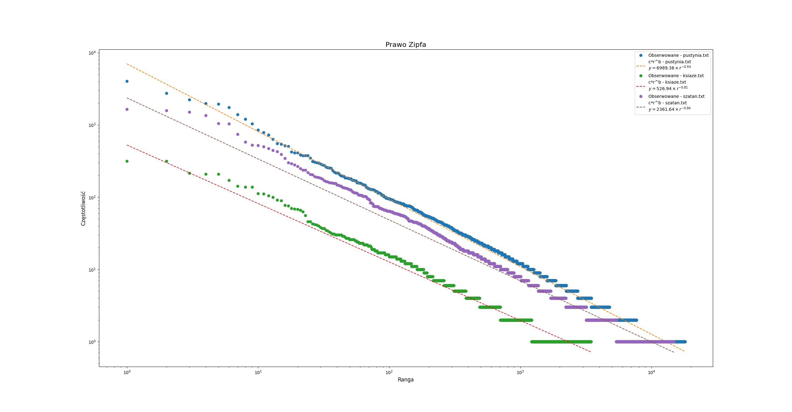
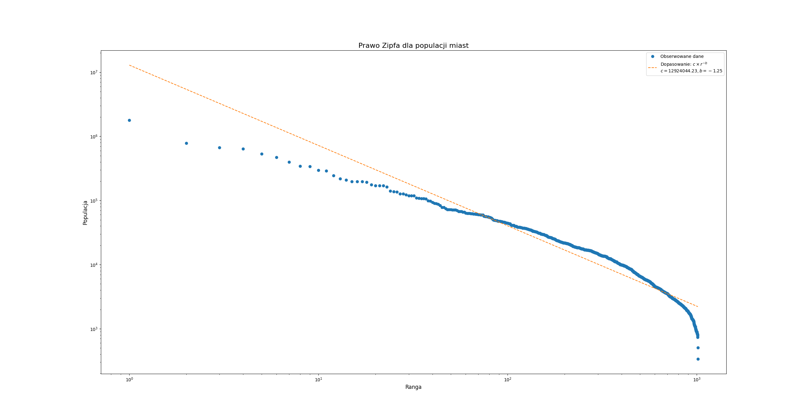

# Sprawozdanie z listy 4 - Prawo Zipfa

# Mateusz Wojteczek


## Wstęp

Moim zadaniem w tym przypadku było zbadanie zjawiska prawa Zipfa w języku naturalnym poprzez analizę rozkładu częstotliwości słów w różnych tekstach. Korzystałem ze strony wolnelektury.pl, skąd brałem legalne lektury szkolne, więc różnorodność tekstów może nie być skrajna. Kontynuując, prawo Zipfa, jedno z fundamentalnych praw lingwistyki kwantytatywnej, sugeruje, że częstotliwość słowa w języku jest odwrotnie proporcjonalna do jego rangi. W ramach analizy napisałem program badający teksty pod kątem zgodności z prawem Zipfa, prezentujący wyniki w formie graficznej na wykresach log-log oraz dopasowujący do nich funkcję postaci c*r ^ −b.


## Kod programu
### Podstawowy program do analizy - zadanie 1.

```python
import re
from collections import Counter
import matplotlib.pyplot as plt

def analyze_zipfs_law(file_paths, output_files):
    plt.figure(figsize=(10, 6))

    for file_path, output_file in zip(file_paths, output_files):
        with open(file_path, 'r', encoding='utf-8') as file:
            text = file.read().lower()

        # Usuwanie znaków interpunkcyjnych
        text = re.sub(r'[^\w\s]', '', text)
        words = text.split()
        count = Counter(words)
        frequencies = sorted(count.items(), key=lambda x: x[1], reverse=True)

        # Zapisywanie statystyk do pliku tekstowego
        with open(output_file, 'w', encoding='utf-8') as f:
            for word, frequency in frequencies:
                f.write(f"{word}: {frequency}\n")

        # Generowanie danych do wykresu
        ranks = range(1, len(frequencies) + 1)
        values = [freq for _, freq in frequencies]

        # Dodawanie serii danych do wykresu
        plt.loglog(ranks, values, label=f'{file_path}')

    plt.xlabel('Ranga')
    plt.ylabel('Częstotliwość')
    plt.title('Prawo Zipfa - porównanie tekstów')
    plt.legend()
    plt.show()

analyze_zipfs_law(['pustynia.txt', 'ksiaze.txt', 'szatan.txt'], ['wynik1.txt', 'wynik2.txt', 'wynik3.txt'])
```
###  Rozwinięcie z dopasowaniem regresji liniowej - zadanie 2.
```python
import re
from collections import Counter
import matplotlib.pyplot as plt
import numpy as np

def analyze_zipfs_law(file_paths, output_files):
    plt.figure(figsize=(10, 6))

    for file_path, output_file in zip(file_paths, output_files):
        with open(file_path, 'r', encoding='utf-8') as file:
            text = file.read().lower()

        # Usuwanie znaków interpunkcyjnych
        text = re.sub(r'[^\w\s]', '', text)
        words = text.split()
        count = Counter(words)
        frequencies = sorted(count.items(), key=lambda x: x[1], reverse=True)

        # Zapisywanie statystyk do pliku tekstowego
        with open(output_file, 'w', encoding='utf-8') as f:
            for word, frequency in frequencies:
                f.write(f"{word}: {frequency}\n")

        # Generowanie danych do wykresu
        ranks = np.arange(1, len(frequencies) + 1)
        values = np.array([freq for _, freq in frequencies])

        # Logarytmowanie danych
        log_ranks = np.log(ranks)
        log_values = np.log(values)

        # Dopasowanie liniowe w przestrzeni log-log
        slope, intercept = np.polyfit(log_ranks, log_values, 1)
        b = -slope  # Wykładnik prawa Zipfa
        c = np.exp(intercept)  # Stała c po przekształceniu z logarytmu

        # Obliczanie dopasowanych wartości
        fitted_values = c * ranks**(-b)

        # Dodawanie serii danych do wykresu
        plt.loglog(ranks, values, marker='o', linestyle='none', label=f'Obserwowane - {file_path}')
        plt.loglog(ranks, fitted_values, label=f'c*r^b - {file_path}\n$y = {c:.2f} \\times r^{{{-b:.2f}}}$', linestyle='--')

    plt.xlabel('Ranga', fontsize = 12)
    plt.ylabel('Częstotliwość', fontsize = 12)
    plt.title('Prawo Zipfa', fontsize = 16)
    plt.legend()
    plt.show()

analyze_zipfs_law(['pustynia.txt', 'ksiaze.txt', 'szatan.txt'], ['wynik1.txt', 'wynik2.txt', 'wynik3.txt'])
```


## Analiza wyników - trzy różne teksty
Analizie poddano trzy teksty o różnym charakterze i stylu, aby zbadać, jak różnorodność materiału językowego wpływa na rozkład częstotliwości słów i wartości wykładnika b.



Dla każdego z analizowanych tekstów wygenerowałem wykres częstotliwości słów w zależności od ich rangi. Wykresy pokazują, jak rozkład częstotliwości słów w każdym tekście przybliża lub odchodzi od idealnego modelu prawa Zipfa. Wykonałem również dopasowanie funkcji postaci c*r ^ −b (co do znaku wykładnika b, przyjąłem go jako ujemny, ponieważ rangi są zazwyczaj przedstawiane w skali logarytmicznej. Kiedy mówimy, że y jest proporcjonalne do r^-b, mówimy, że logarytm y jest proporcjonalny do -b razy logarytm r. To jest równoważne stwierdzeniu, że na wykresie log-log, dane powinny układać się wzdłuż prostej linii o nachyleniu -b. Przy analizie przyjmę natomiast b za dodatnie), a uzyskane wartości wykładnika b zinterpretuję poniżej w kontekście lingwistycznym.

### Interpretacja ogólna wykładnika b

Wykładnik b w prawie Zipfa ma kluczowe znaczenie dla lingwistyki, ponieważ opisuje on rozkład częstotliwości słów w języku. W kontekście prawa Zipfa, które mówi, że częstotliwość słowa jest odwrotnie proporcjonalna do jego rangi w korpusie (czyli najczęstsze słowo występuje dwa razy częściej niż drugie w kolejności, trzy razy częściej niż trzecie itd.), wykładnik b opisuje stopień tej odwrotności.

b≈1: Kiedy wykładnik b jest bliski 1, oznacza to, że rozkład częstotliwości słów w tekście blisko odpowiada klasycznemu prawu Zipfa. Wiele języków naturalnych i dużych korpusów tekstowych wykazuje wykładniki bliskie tej wartości, co sugeruje, że w języku występuje naturalna tendencja do tworzenia się takiego rozkładu. Słowa są więc rozłożone w taki sposób, że niewielka liczba słów jest bardzo często używana (np. spójniki, przyimki), podczas gdy większość słów pojawia się stosunkowo rzadko.

b < 1: Gdy b jest mniejsze od 1, rozkład częstotliwości jest płaski, co oznacza, że różnice w częstotliwości między słowami o wysokiej i niskiej randze są mniejsze. Może to wskazywać na teksty o większym zróżnicowaniu słownictwa lub takie, w których autor stara się unikać powtarzania tych samych słów.

b > 1: Wykładnik większy niż 1 oznacza stromszy spadek częstotliwości słów wraz ze wzrostem ich rangi, co sugeruje, że niewielka liczba słów dominuje w tekście. Może to wskazywać na ograniczone słownictwo lub teksty, które opierają się na wielokrotnym używaniu pewnych słów kluczowych lub fraz (np. niektóre formy poezji, piosenki, teksty o bardzo wąskiej tematyce).

### Interpretacje moich wyników wykładników b

b = 0.94 dla pierwszego tekstu wskazuje na bardzo wysoką zgodność z prawem Zipfa. Sugeruje to, że tekst ten ma typową dla języka naturalnego hierarchię częstotliwości słów, gdzie niewielka liczba słów jest używana bardzo często, a większość słów pojawia się rzadko.

b = 0.81 i b = 0.84 dla drugiego i trzeciego tekstu również wskazują na zgodność z prawem Zipfa, choć są nieco niższe od 1. Może to oznaczać, że te teksty mają nieco większe zróżnicowanie słownictwa i mniejszą dominację najczęściej używanych słów w porównaniu z pierwszym tekstem.

## Zadanie 3 - szukanie prawa Zipfa w zbiorze miast Polskich.

### Kod programu - wyselekcjonowanie potrzebnych danych (nazwa miasta, populacja) z danych pobranych z Wikipedii.

``` python
# Załadowanie danych do słownika w celu rozdziału danych o miastach w Polsce zaczerpniętych z Wikipedii.
data = 'dane_wikipedia.txt'
output = 'miasta.txt'
# Read data from the input file
with open(data, 'r', encoding='utf-8') as input_file:
    lines = input_file.readlines()

# Process the data to extract city names and populations
cities_population = [line.split("\t") for line in lines]
output_lines = [f"{city[0]} {city[4]}\n" for city in cities_population if len(city) > 4]

# Write the processed data to the output file
with open(output, "w", encoding='utf-8') as output_file:
    output_file.writelines(output_lines)

output
```

### Kod programu - analiza rozkładu populacji miast

``` python
import matplotlib.pyplot as plt
import numpy as np

def analyze_city_populations(file_path):
    cities = []
    populations = []

    with open(file_path, 'r', encoding='utf-8') as file:
        for line in file:
            parts = line.split()  # Dzielenie wiersza na części
            if len(parts) >= 2:
                city = ' '.join(parts[:-1])  # Wszystko poza ostatnim elementem to nazwa miasta
                population = parts[-1]  # Ostatni element to populacja
                try:
                    # Próba konwersji populacji na int i zapisanie danych
                    population = int(population.replace(',', ''))
                    cities.append(city)
                    populations.append(population)
                except ValueError:
                    # Pominięcie wierszy, których nie można przekształcić w int
                    continue

    # Generowanie danych do wykresu
    ranks = np.arange(1, len(cities) + 1)
    values = np.array(populations)

    # Logarytmowanie danych
    log_ranks = np.log(ranks)
    log_values = np.log(values)

    # Dopasowanie liniowe w przestrzeni log-log
    slope, intercept = np.polyfit(log_ranks, log_values, 1)
    b = -slope  # Wykładnik prawa Zipfa
    c = np.exp(intercept)  # Stała c po przekształceniu z logarytmu

    # Obliczanie dopasowanych wartości
    fitted_values = c * ranks**(-b)

    # Rysowanie wykresów
    plt.figure(figsize=(10, 6))
    plt.loglog(ranks, values, marker='o', linestyle='none', label='Obserwowane dane')
    plt.loglog(ranks, fitted_values, label=f'Dopasowanie: $c \\times r^{{-b}}$\n$c = {c:.2f}, b = {-b:.2f}$', linestyle='--')
    plt.xlabel('Ranga', fontsize=12)
    plt.ylabel('Populacja', fontsize=12)
    plt.title('Prawo Zipfa dla populacji miast', fontsize=16)
    plt.legend()
    plt.show()

# Wywołanie funkcji z ścieżką do pliku zawierającego dane o miastach
analyze_city_populations('miasta.txt')
```



Na załączonym wykresie linia dopasowania wskazuje na spadek częstotliwości z rangą. Wiele punktów danych jest bliska tej linii regresji (co sugeruje, że liniowa regresja jest dobrym przybliżeniem danych), jest to wskazówka, że możliwym jest by rozkład populacji miast był zgodny z prawem Zipfa. Dodatkowo, wartość b na wykresie wynosi 1.25, co jest dość blisko wartości 1 i wskazuje na możliwe zastosowanie prawa Zipfa do tych danych. Wartości te sugerują, że w miarę wzrostu rangi miasta, jego populacja zmniejsza się w sposób przewidywalny, co jest zgodne z prawem Zipfa.


## Wnioski
Analiza trzech różnorodnych tekstów potwierdziła obecność prawa Zipfa w języku naturalnym, choć z różnym stopniem zgodności w zależności od charakteru tekstu. Wartości wykładnika b w analizowanych tekstach wskazują na różnice w bogactwie słownictwa i stylu autorów. Z perspektywy lingwistycznej, wyniki te mogą dostarczać pewien wgląd w naturę języka i procesów komunikacyjnych. Analiza takich danych może pomóc w zrozumieniu, jak różnorodne czynniki, takie jak gatunek literacki, styl autora czy tematyka, wpływają na strukturę językową i wykorzystanie słów przez pisarza. 


