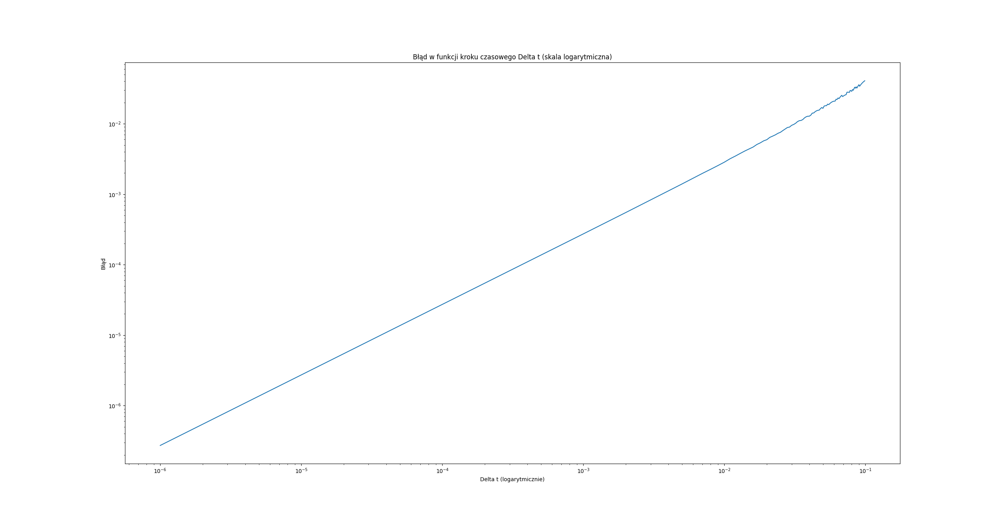
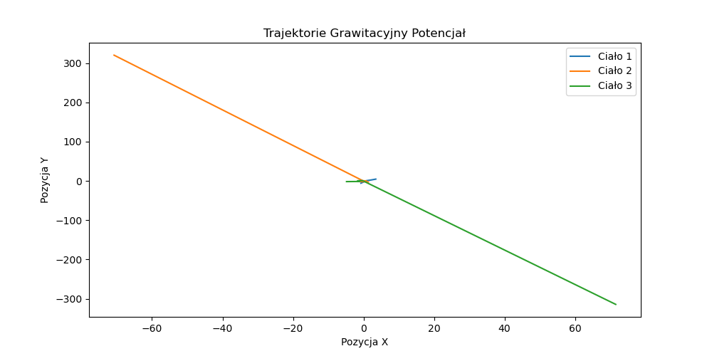
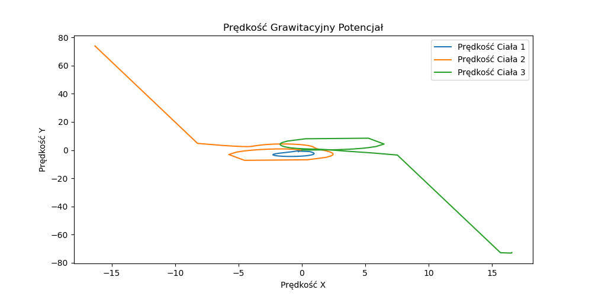
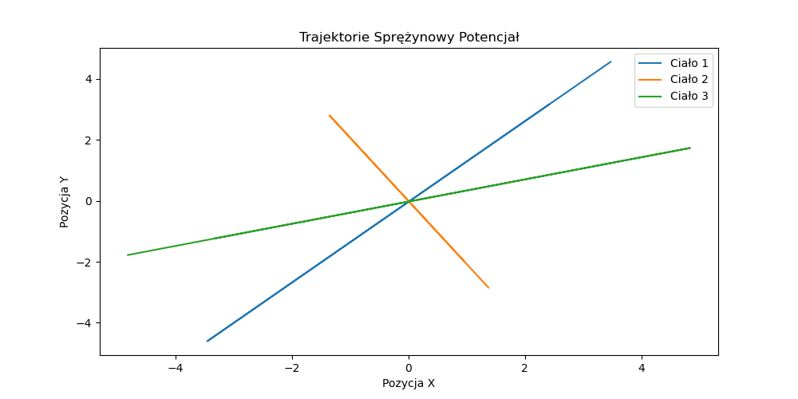
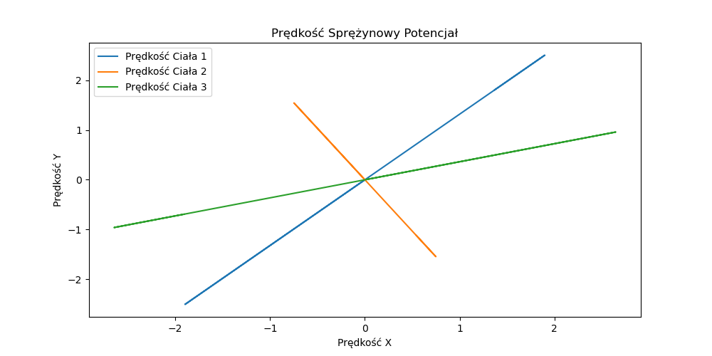
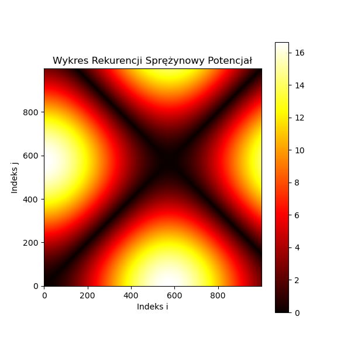

# Sprawozdanie z listy 5 - Problem trzech ciał
# Mateusz Wojteczek


## Wstęp

Celem niniejszej listy zadań jest zbadanie dynamiki systemów wielociałowych poprzez symulację ich ruchu pod wpływem różnych sił oddziaływania. Kluczowym zadaniem jest implementacja i analiza modelu grawitacyjnego, gdzie ciała oddziałują zgodnie z prawem powszechnego ciążenia Newtona. Symulacje te są ważnym narzędziem w naukach takich jak astronomia, fizyka oraz inżynieria kosmiczna, umożliwiając zrozumienie i przewidywanie zachowań systemów planetarnych, podwójnych gwiazd czy nawet galaktyk.


## Zadanie 1
### Kod programu

```python
import numpy as np
import matplotlib.pyplot as plt

# Inicjalizacja stałych
N = 2
G = 1
m = np.ones(N)  # masy
R = 1  # promień orbity

# Inicjalizacja położeń i prędkości
x = np.zeros(N)
y = np.zeros(N)
vx = np.zeros(N)
vy = np.zeros(N)

x[1] = R
vy[1] = np.sqrt(G * m[0] / R)

# Funkcja do obliczania siły grawitacji
def oblicz_sile_grawitacji(x, y, m):
    Fx = np.zeros(N)
    Fy = np.zeros(N)
    for i in range(N):
        for j in range(N):
            if i != j:
                dx = x[j] - x[i]
                dy = y[j] - y[i]
                r = np.sqrt(dx**2 + dy**2)
                Fg = G * m[i] * m[j] / r**3
                Fx[i] += Fg * dx
                Fy[i] += Fg * dy
    return Fx, Fy

# Analiza błędu dla różnych wartości Delta t
dt_values = np.arange(0.000001, 0.01, 0.000001)
errors = []

for dt in dt_values:
    # Reset pozycji i prędkości
    x[1] = R
    y[1] = 0
    vx[1] = 0
    vy[1] = np.sqrt(G * m[0] / R)
    
    # Symulacja
    for t in np.arange(0, 10, dt):
        Fx, Fy = oblicz_sile_grawitacji(x, y, m)
        for i in range(1, N):  # Pomijamy aktualizację dla i = 0 (ciało nieruchome)
            vx[i] += Fx[i] / m[i] * dt
            vy[i] += Fy[i] / m[i] * dt
            x[i] += vx[i] * dt
            y[i] += vy[i] * dt

    # Obliczanie błędu
    r_final = np.sqrt((x[1] - x[0])**2 + (y[1] - y[0])**2)
    error = abs(R - r_final)
    errors.append(error)
# Wykres błędu w funkcji Delta t z logarytmiczną skalą osi X
plt.plot(dt_values, errors)
plt.xscale('log')  # Ustawienie skali logarytmicznej dla osi X
plt.yscale('log')
plt.xlabel('Delta t (logarytmicznie)')
plt.ylabel('Błąd')
plt.title('Błąd w funkcji kroku czasowego Delta t (skala logarytmiczna)')
plt.show()

# Znalezienie maksymalnej wartości Delta t dla błędu mniejszego niż 10^-5
indeksy = np.where(np.array(errors) < 1e-5)[0]
if indeksy.size > 0:  # Sprawdzenie, czy znaleziono jakiekolwiek odpowiednie wartości Delta t
    max_dt = dt_values[indeksy[-1]]
    print(f"Maksymalna wartość Delta t z błędem mniejszym niż 10^-5: {max_dt}")
else:
    print("Nie znaleziono wartości Delta t z błędem mniejszym niż 10^-5 w podanym zakresie.")
```

## Analiza wyników 



Symulacja ruchu dwóch ciał oddziałujących grawitacyjnie pokazała, że precyzja rozwiązania zależy od wielkości kroku czasowego. Im mniejszy krok, tym większa dokładność symulacji, co jest widoczne na załączonym wykresie. Wyniki te potwierdzają, że symulator poprawnie implementuje prawa ruchu planetarnego, a metoda numeryczna jest efektywna dla odpowiednio małych wartości kroku czasowego.

## Zadanie 2
### Kod programu
```python

import numpy as np
import matplotlib.pyplot as plt
import os

class Point:
    def __init__(self, m, x, y, vx, vy):
        self.m = m  # Masa punktu
        self.x = x  # Pozycja x punktu
        self.y = y  # Pozycja y punktu
        self.vx = vx  # Prędkość w kierunku x
        self.vy = vy  # Prędkość w kierunku y

def gravitational_force(p1, p2, G):
    rx = p2.x - p1.x  # Różnica pozycji x między punktami
    ry = p2.y - p1.y  # Różnica pozycji y między punktami
    distance_squared = rx ** 2 + ry ** 2  # Kwadrat odległości między punktami
    if distance_squared == 0:
        return (0, 0)  # Zapobiegaj dzieleniu przez zero, jeśli oba punkty się pokrywają
    distance_cubed = np.sqrt(distance_squared ** 3)  # Trzecia potęga odległości
    fx = G * p1.m * p2.m * rx / distance_cubed  # Składowa siły grawitacyjnej w kierunku x
    fy = G * p1.m * p2.m * ry / distance_cubed  # Składowa siły grawitacyjnej w kierunku y
    return (fx, fy)

# Ustawienia symulacji
G = 1  # Stała grawitacyjna
Vs = np.arange(0.01, 1, 0.01)  # Zakres prędkości początkowych
dt = 0.001  # Krok czasowy
t = 10  # Całkowity czas symulacji
steps = int(t / dt)  # Liczba kroków

# Katalog do zapisywania danych o pozycji i wykresów
directory = 'pozycje'
if not os.path.exists(directory):
    os.makedirs(directory)

plot_directory = 'wykresy'
if not os.path.exists(plot_directory):
    os.makedirs(plot_directory)

# Obliczenie teoretycznej v dla orbity kołowej
m1 = m2 = 1  # Masy
v_theoretical = np.sqrt((m2**2) / (m1 + m2))

ratios = []  # Lista przechowująca stosunki długości d1 do d2
for v in Vs:
    points = [Point(1, 0, 0, 0, -v), Point(1, 1, 0, 0, v)]  # Utworzenie dwóch punktów
    x1_positions = []  # Lista przechowująca pozycje x pierwszego punktu
    y1_positions = []  # Lista przechowująca pozycje y pierwszego punktu
    position_data = []  # Lista przechowująca dane o pozycji

    for i in range(steps):
        for p in range(len(points)):
            total_fx = total_fy = 0
            for s in range(len(points)):
                if p != s:
                    fx, fy = gravitational_force(points[p], points[s], G)
                    total_fx += fx
                    total_fy += fy

            ax = total_fx / points[p].m
            ay = total_fy / points[p].m
            points[p].vx += ax * dt
            points[p].vy += ay * dt
            points[p].x += points[p].vx * dt
            points[p].y += points[p].vy * dt

        x1_positions.append(points[0].x)
        y1_positions.append(points[0].y)
        position_data.append(f"{points[0].x} {points[0].y} {points[1].x} {points[1].y}")

    # Zapis danych do pliku na koniec symulacji
    file_name = f"{directory}/pozycje_v_{v:.2f}.txt"
    with open(file_name, 'w') as file:
        file.write("\n".join(position_data))

    # Obliczenie i zapisanie stosunków długości d1 do d2 dla wykresu
    d1 = max(x1_positions) - min(x1_positions)
    d2 = max(y1_positions) - min(y1_positions)
    ratio = d1 / d2
    ratios.append(ratio)

# Wykres stosunku długości d1 do d2
plt.figure(figsize=(10, 5))
plt.plot(Vs, ratios, label='Stosunek d1/d2')
plt.axvline(x=v_theoretical, color='r', linestyle='--', label=f'Teoretyczna v dla orbity kołowej = {v_theoretical:.2f}')
plt.title("Stosunek długości d1/d2 w funkcji prędkości początkowej v")
plt.xlabel("Prędkość początkowa v")
plt.ylabel("Stosunek długości d1/d2")
plt.legend()
plt.grid(True)
plot_path = f"{plot_directory}/wykres_stosunek_d1_d2.png"
plt.savefig(plot_path)
plt.close()

# Generowanie i zapisywanie wykresów dla wszystkich trajektorii po zakończeniu wszystkich symulacji
for v in Vs:
    file_name = f"{directory}/pozycje_v_{v:.2f}.txt"
    x1, y1, x2, y2 = [], [], [], []
    with open(file_name, 'r') as file:
        for line in file:
            positions = list(map(float, line.split()))
            x1.append(positions[0])
            y1.append(positions[1])
            x2.append(positions[2])
            y2.append(positions[3])

    plt.figure(figsize=(10, 5))
    plt.plot(x1, y1, label='Ciało 1')
    plt.plot(x2, y2, label='Ciało 2')
    plt.title(f"Trajektoria dla prędkości początkowej v={v:.2f}")
    plt.xlabel("X")
    plt.ylabel("Y")
    plt.legend()
    plot_path = f"{plot_directory}/trajektoria_v_{v:.2f}.png"
    plt.savefig(plot_path)  # Zapisz wykres
    plt.close()  

```
## Analiza wyników 
### Przykładowe wykresy trajektorii - więcej w folderze "wykresy"


Tu mamy wykres dla wyliczonej, idealnej prędkości v, równej 0.71.


Mimo, że wykres wartości d1 do d2 nie odwzorowuje idealnie tego rpzedstawionego jako przykład w treści zadania, w pewnych momentach nawet go przypomina., co sugeruje, że udało się osiągnąć ostatecznie pewne efekty, mimo dużych trudności.


## Zadanie 3
### Kod programu
```python
import numpy as np
import matplotlib.pyplot as plt

# Parametry symulacji
G = 1.0  # Stała grawitacyjna
k = 1.0  # Stała sprężystości
m = 10  # Masa każdego z ciał
dt = 0.01  # Krok czasowy
t_max = 10  # Czas symulacji
steps = int(t_max / dt)

# Pozycje i prędkości początkowe
positions = np.array([
    [3.4722222222222197, 4.555555555555556],
    [1.3749999999999982, -2.847222222222224],
    [-4.819444444444439, -1.7777777777777795]
])
velocities = np.zeros_like(positions)  # Początkowe prędkości zerowe

# Obliczanie sił w zależności od potencjału
def compute_forces(pos, use_gravitational=True):
    n = len(pos)
    forces = np.zeros_like(pos)
    for i in range(n):
        for j in range(i + 1, n):
            r = pos[j] - pos[i]
            dist = np.linalg.norm(r)
            if use_gravitational:
                force = G * m**2 * r / dist**3  # Siła grawitacyjna zależna od odległości
            else:
                force = k * r  # Siła sprężystości proporcjonalna do odległości
            forces[i] += force
            forces[j] -= force
    return forces

# Symulacja dla obu potencjałów
for use_grav in [True, False]:
    pos = np.copy(positions)
    vel = np.zeros_like(positions)
    traj = []  # Trajektoria - lista zawierająca kolejne położenia
    vel_traj = []  # Trajektoria prędkości - lista zawierająca kolejne prędkości

    for step in range(steps):
        forces = compute_forces(pos, use_gravitational=use_grav)
        vel += forces / m * dt
        pos += vel * dt
        traj.append(pos.copy())
        vel_traj.append(vel.copy())

    traj = np.array(traj)
    vel_traj = np.array(vel_traj)

    # Generowanie macierzy rekurencji
    nit = len(traj)
    R = np.zeros((nit, nit))
    for i in range(nit):
        for j in range(nit):
            R[i, j] = np.linalg.norm(traj[i] - traj[j])

    # Wykresy
    plt.figure(figsize=(10, 5))
    for i in range(3):
        plt.plot(traj[:, i, 0], traj[:, i, 1], label=f'Ciało {i+1}')
    plt.title(f'Trajektorie {"Grawitacyjny" if use_grav else "Sprężynowy"} Potencjał')
    plt.xlabel('Pozycja X')
    plt.ylabel('Pozycja Y')
    plt.legend()
    plt.show()

    plt.figure(figsize=(10, 5))
    for i in range(3):
        plt.plot(vel_traj[:, i, 0], vel_traj[:, i, 1], label=f'Prędkość Ciała {i+1}')
    plt.title(f'Prędkość {"Grawitacyjny" if use_grav else "Sprężynowy"} Potencjał')
    plt.xlabel('Prędkość X')
    plt.ylabel('Prędkość Y')
    plt.legend()
    plt.show()

    # Wykres rekurencji
    plt.figure(figsize=(6, 6))
    plt.imshow(R, origin='lower', cmap='hot', interpolation='none')
    plt.colorbar()
    plt.title(f'Wykres Rekurencji {"Grawitacyjny" if use_grav else "Sprężynowy"} Potencjał')
    plt.xlabel('Indeks i')
    plt.ylabel('Indeks j')
    plt.show()

```
## Analiza wyników 
### Przykładowe wykresy trajektorii 












Przez długość symulacji musiałem dostosować dt dość duże, co wpływa na precyzję moich wykresów, które nie są do końca takie jakich mozna było oczekiwać, zwłaszcza jeśli chodzi o wykresy rekurencji dla wektorów stanu układów. Niemniej jednak, udało się zaimplementować większość mechanik w kodzie.

## Wnioski
Zadanie 1: Symulując ruch dwóch ciał oddziałujących grawitacyjnie, zauważyłem, że precyzja numeryczna rozwiązania równań ruchu silnie zależy od wielkości kroku czasowego. Wykres błędu w funkcji Δ𝑡 pozwolił mi ustalić odpowiedni krok dla zadanej dokładności, co jest istotne przy modelowaniu ruchu orbitalnego w układach dwuciałowych.

Zadanie 2: Badając, jak zmienia się kształt orbit dwóch ciał pod wpływem różnych prędkości początkowych, zaobserwowałem przejście od trajektorii eliptycznych do bardziej złożonych. Analiza stosunku osi elips pozwoliła mi zidentyfikować prędkości prowadzące do ruchu po orbitach zbliżonych do okręgu.

Zadanie 3: Przeanalizowałem zachowanie trzech ciał oddziałujących za pomocą dwóch różnych potencjałów. Wykresy rekurencji i trajektorie dla potencjału grawitacyjnego ukazały skomplikowane, chaotyczne wzorce, natomiast dla potencjału sprężynowego ruch był bardziej regularny i przewidywalny. Mimo nieidalnego rozwiązania, porównanie tych dwóch potencjałów podkreśliło, jak wybór oddziaływań wpływa na dynamikę i potencjalny chaos w systemach wielociałowych.
