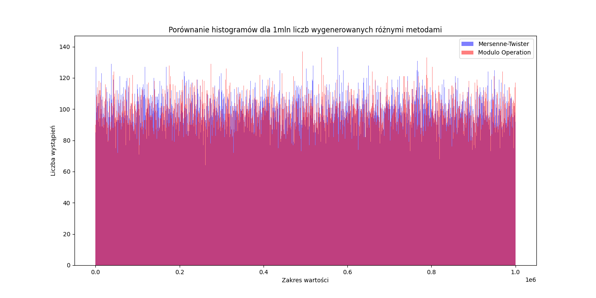
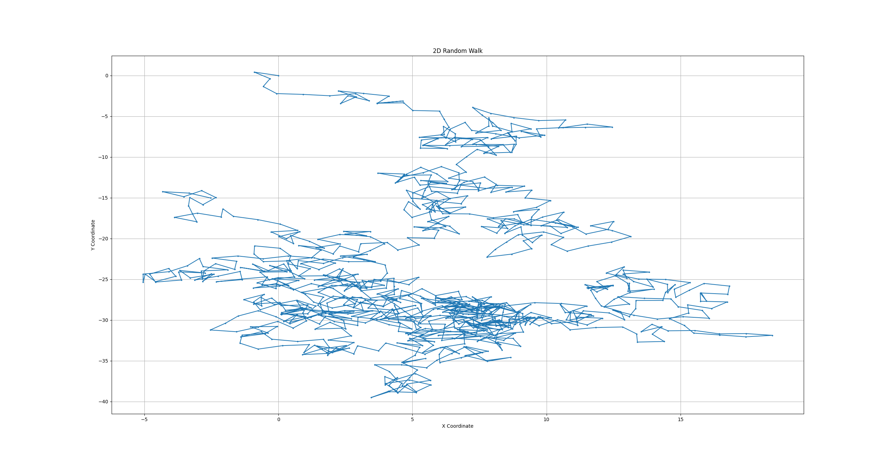
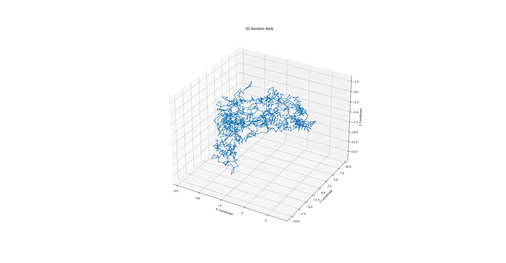
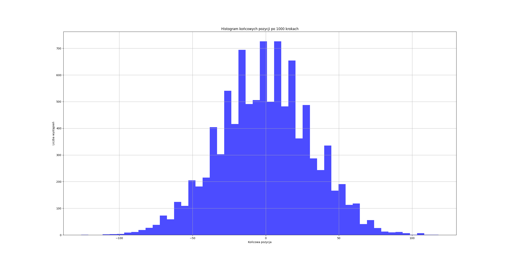
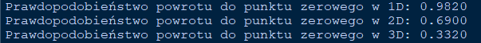
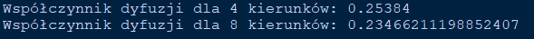

# Sprawozdanie z listy 6 - Spacer losowy
# Mateusz Wojteczek


## Wstęp

Celem listy zadań jest zbadanie zachowań i charakterystyk spacerów losowych w różnych wymiarach i kontekstach. Spacer losowy to model matematyczny opisujący ścieżkę składającą się z serii losowych kroków, często stosowany w fizyce, ekonomii, biologii i innych naukach. Zrozumienie jego właściwości ma kluczowe znaczenie dla interpretacji wielu zjawisk naturalnych i procesów stochastycznych.


## Zadanie 1
### Kod programu

```python
import matplotlib.pyplot as plt
import numpy as np
import random

# Ilość liczb do wygenerowania
n = 1000000

# Generowanie 1mln liczb za pomocą generatora Mersenne-Twister z numpy
x = np.random.randint(0, 1000000, n)

# Generowanie 1mln liczb za pomocą prostego generatora opartego na operacji modulo
random.seed(0)  # Ustawienie ziarna dla powtarzalności
y = [random.randrange(0, 1000000) % 1000000 for _ in range(n)]

# Histogramy
bins = 10000

# Histogram dla Mersenne-Twister
hist_x, bins_x = np.histogram(x, bins=bins)

# Histogram dla generatora opartego na operacji modulo
hist_y, bins_y = np.histogram(y, bins=bins)

# Tworzenie histogramów
plt.figure(figsize=(14, 7))
plt.hist(x, bins=bins, alpha=0.5, label='Mersenne-Twister', color='blue')
plt.hist(y, bins=bins, alpha=0.5, label='Modulo Operation', color='red')
plt.legend(loc='upper right')
plt.title('Porównanie histogramów dla 1mln liczb wygenerowanych różnymi metodami')
plt.xlabel('Zakres wartości')
plt.ylabel('Liczba wystąpień')
plt.show()

# Wyświetlanie różnicy między kubełkami
differences = np.abs(hist_x - hist_y)
print("Średnia różnica między kubełkami: ", np.mean(differences))
print("Maksymalna różnica między kubełkami: ", np.max(differences))

np.savetxt("histogram_mersenne_twister.csv", hist_x, delimiter=",")
np.savetxt("histogram_modulo.csv", hist_y, delimiter=",")

```

## Analiza wyników 


Mersenne-Twister: Liczby generowane przez ten algorytm wykazały znaczną równomierność w rozkładzie, z niewielkimi fluktuacjami liczby wystąpień między poszczególnymi kubełkami.

Operacja modulo: Histogram dla tej metody pokazał większe fluktuacje w liczbie wystąpień, z niektórymi kubełkami wyraźnie odbiegającymi od średniej liczby wystąpień, co sugeruje mniej równomierny rozkład.

Analiza pokazała, że algorytm Mersenne-Twister jest bardziej odpowiedni dla zastosowań, które wymagają wysokiej jakości równomiernego rozkładu liczb losowych. Prosty generator oparty na operacji modulo może być mniej efektywny w przypadkach, gdy równomierność rozkładu jest kluczowa, jak np. w modelowaniu statystycznym czy symulacjach. Wyniki te podkreślają znaczenie wyboru odpowiedniego generatora liczb losowych w zależności od wymagań konkretnego zastosowania.

## Zadanie 2
### Kod programu
#### Spacer losowy 2D
```cpp

#include <iostream>
#include <fstream>
#include <gsl/gsl_rng.h>
#include <gsl/gsl_randist.h>
#include <cmath>
#include <iomanip>

int main() {
    const gsl_rng_type * T;
    gsl_rng * r;

    int n = 1000; // number of steps
    double x = 0, y = 0; // start at the origin, using double for better precision

    std::ofstream file;
    file.open("random_walk_2D.txt");

    gsl_rng_env_setup();

    T = gsl_rng_default;
    r = gsl_rng_alloc(T);

    gsl_rng_set(r, time(NULL)); // Set the seed based on current time for randomness

    file << "0,0" << std::endl;  // Save the starting point

    for (int i = 0; i < n; i++) {
        double angle = gsl_ran_flat(r, 0, 2 * M_PI);
        std::cout << "Step " << i << ": Angle = " << angle << std::endl; // Debug output to console
        x += cos(angle);
        y += sin(angle);
        file << std::fixed << std::setprecision(4) << x << "," << y << std::endl;  // Ensure precision for small increments
    }

    file.close();
    gsl_rng_free(r);
    return 0;
}

```
#### Spacer losowy 3D

```cpp
#include <iostream>
#include <fstream>
#include <gsl/gsl_rng.h>
#include <gsl/gsl_randist.h>
#include <cmath>
#include <iomanip>  // Include for std::setprecision

int main() {
    const gsl_rng_type * T;
    gsl_rng * r;

    int n = 1000; // number of steps
    double x = 0, y = 0, z = 0; // start at the origin, using double for better precision

    std::ofstream file;
    file.open("random_walk_3D.txt");

    gsl_rng_env_setup();

    T = gsl_rng_default;
    r = gsl_rng_alloc(T);

    gsl_rng_set(r, time(NULL)); // Set the seed based on current time for randomness

    file << "0,0,0" << std::endl; // Save the starting point

    for (int i = 0; i < n; i++) {
        double phi = gsl_ran_flat(r, 0, 2 * M_PI);
        double theta = acos(gsl_ran_flat(r, -1, 1));
        x += sin(theta) * cos(phi);
        y += sin(theta) * sin(phi);
        z += cos(theta);
        file << std::fixed << std::setprecision(4) << x << "," << y << "," << z << std::endl;
    }

    file.close();
    gsl_rng_free(r);
    return 0;
}
```
### Skrypty do generowania wykresów
#### Wykres spaceru 2D

```python
import matplotlib.pyplot as plt

# Load data
x, y = [], []
with open("random_walk_2D.txt", "r") as file:
    for line in file:
        parts = line.strip().split(',')
        x.append(float(parts[0]))
        y.append(float(parts[1]))

# Plot
plt.figure(figsize=(8, 8))
plt.plot(x, y, marker='o', markersize=2)
plt.title("2D Random Walk")
plt.xlabel("X Coordinate")
plt.ylabel("Y Coordinate")
plt.grid(True)
plt.show()
```

#### Wykres spaceru 3D
```python
import matplotlib.pyplot as plt
from mpl_toolkits.mplot3d import Axes3D

# Load data
x, y, z = [], [], []
with open("random_walk_3D.txt", "r") as file:
    for line in file:
        parts = line.strip().split(',')
        x.append(float(parts[0]))
        y.append(float(parts[1]))
        z.append(float(parts[2]))

# Plot
fig = plt.figure(figsize=(8, 8))
ax = fig.add_subplot(111, projection='3d')
ax.plot(x, y, z, marker='o', markersize=2)
ax.set_title("3D Random Walk")
ax.set_xlabel("X Coordinate")
ax.set_ylabel("Y Coordinate")
ax.set_zlabel("Z Coordinate")
plt.show()
```


## Analiza wyników 
### Przykładowe wykresy trajektorii - więcej w folderze "wykresy"




W przestrzeni dwuwymiarowej trajektoria przedstawia złożony, ale skoncentrowany wzór, gdzie ścieżka przecina sama siebie wielokrotnie, tworząc liczne pętle. To ilustruje charakterystykę spacerów losowych w niskich wymiarach, gdzie prawdopodobieństwo powrotu do wcześniejszej lokalizacji jest wysokie.
Natomiast w przestrzeni trójwymiarowej trajektoria jest znacznie bardziej rozproszona niż w przypadku 2D. Spacer wydaje się bardziej rozciągnięty i mniej skoncentrowany, z mniejszą liczbą przecięć. Wzór w 3D pokazuje, jak dodanie kolejnego wymiaru może zmniejszyć prawdopodobieństwo powrotu do poprzednich pozycji.


## Zadanie 3
### Kod programu

```python
import numpy as np
import matplotlib.pyplot as plt

np.random.seed(0)  # For repeatability
n_steps = 1000
n_simulations = 10000
final_positions = []

for _ in range(n_simulations):
    steps = np.random.choice([-1, 1], size=n_steps)  # Random steps
    final_position = np.sum(steps)  # Adding steps to get the final position
    final_positions.append(final_position)

# Creating a histogram
plt.figure(figsize=(10, 6))
plt.hist(final_positions, bins=50, color='blue', alpha=0.7)
plt.title('Histogram końcowych pozycji po 1000 krokach')
plt.xlabel('Końcowa pozycja')
plt.ylabel('Liczba wystąpień')
plt.grid(True)
plt.show()
```

## Analiza wyników 


Histogram, który został wygenerowany, wizualnie reprezentuje rozkład końcowych pozycji dziecka po wykonaniu 1000 kroków w jednowymiarowym spacerze losowym, gdzie każdy krok ma równą szansę być wykonanym w lewo (-1) lub w prawo (+1).
Dziecko ma dużo większe prawdopodobieństwo znalezienia się blisko punktu początkowego, w odległości 1 jednostki, niż w odległości 30 jednostek od punktu startowego. Wyniki te są zgodne z teoretycznym modelem spaceru losowego, gdzie większe odległości są mniej prawdopodobne w wyniku sumowania równie prawdopodobnych, niezależnych kroków. Kształt rozkładu jest zbliżony do gaussowskiego (normalnego), co jest typowym wynikiem sumy dużej liczby losowych, jednakowo rozłożonych zmiennych (Twierdzenie Centralne Graniczne).

## Zadanie 4
### Kod programu

```python
import numpy as np

def simulate_random_walk(dimension, steps):
    position = np.zeros(dimension)
    for _ in range(steps):
        move_direction = np.random.randint(0, 2*dimension)
        axis = move_direction // 2
        direction = 1 if move_direction % 2 == 0 else -1
        position[axis] += direction
        if np.all(position == 0):
            return True
    return False

def calculate_return_probability(dimension, num_walks, walk_length):
    successes = 0
    for _ in range(num_walks):
        if simulate_random_walk(dimension, walk_length):
            successes += 1
    return successes / num_walks

for d in range(1, 4):
    probability = calculate_return_probability(d, 1000, 1000)
    print(f"Prawdopodobieństwo powrotu do punktu zerowego w {d}D: {probability:.4f}")
```

## Analiza wyników 


Wyniki pokazują wyraźny trend: zwiększenie wymiaru przestrzeni, w której odbywa się spacer, prowadzi do znacznego spadku prawdopodobieństwa powrotu do punktu wyjścia. Jest to zgodne z teoretycznymi przewidywaniami na temat spacerów losowych:

W 1D: Spacer ma bardzo wysokie prawdopodobieństwo powrotu do punktu startowego, co jest typowe dla jednowymiarowych błądzeń losowych.
W 2D: Prawdopodobieństwo to jest już niższe, co odzwierciedla większą przestrzeń do eksploracji i mniejszą szansę na powrót.
W 3D: Prawdopodobieństwo to jest najniższe, co ilustruje fakt, że w trójwymiarowej przestrzeni istnieje jeszcze więcej ścieżek, które oddalają od punktu początkowego.

## Zadanie 5
### Kod programu

```python
import numpy as np

def simulate_random_walk(steps, directions):
    if directions == 4:
        moves = np.random.choice(range(4), size=steps)
        sin_move = np.sin(moves * np.pi / 2)
        cos_move = np.cos(moves * np.pi / 2)
    elif directions == 8:
        moves = np.random.choice(range(8), size=steps)
        angle = moves * np.pi / 4
        sin_move = np.sin(angle)
        cos_move = np.cos(angle)

    x = np.cumsum(cos_move)
    y = np.cumsum(sin_move)
    msd = np.mean(x[-1]**2 + y[-1]**2)
    return msd

def calculate_diffusion_coefficient(steps, num_simulations, directions):
    msds = [simulate_random_walk(steps, directions) for _ in range(num_simulations)]
    mean_msd = np.mean(msds)
    diffusion_coefficient = mean_msd / (4 * steps)
    return diffusion_coefficient

# Parameters
steps = 10000
num_simulations = 1000

# Calculate diffusion coefficients
D_4 = calculate_diffusion_coefficient(steps, num_simulations, 4)
D_8 = calculate_diffusion_coefficient(steps, num_simulations, 8)

print(f"Współczynnik dyfuzji dla 4 kierunków: {D_4}")
print(f"Współczynnik dyfuzji dla 8 kierunków: {D_8}")
```

## Analiza wyników 


Zmiana liczby kierunków z czterech na osiem nieco zmniejszyła wartość współczynnika dyfuzji. Choć intuituwnie mogłoby się wydawać, że dodanie dodatkowych kierunków ruchu mogłoby zwiększyć dyfuzję, wyniki wskazują na odwrotność:
    4 kierunki: Ruch jest bardziej bezpośredni i koncentruje się na czterech głównych osiach, co może prowadzić do większego rozproszenia na dłuższe dystanse.
    8 kierunków: Dodanie przekątnych sprawia, że ścieżka jest bardziej zmienna i potencjalnie bardziej ograniczona do mniejszych obszarów, zmniejszając efektywne rozprzestrzenianie się.

## Wnioski
W ramach Listy 6 udało się przeprowadzić szereg symulacji i analiz modelujących różnorodne scenariusze związane ze spacerami losowymi i ruchem cząsteczek. Zadania te pozwoliły na głębsze zrozumienie dynamiki systemów wielociałowych oraz procesów dyfuzyjnych w różnych warunkach.

Każde zadanie dostarczyło wartościowych danych, które pomogły zilustrować kluczowe koncepcje teoretyczne, takie jak prawdopodobieństwo powrotu do punktu początkowego, wpływ wymiarowości na zachowanie systemów oraz zmiany w dyfuzji przy różnych schematach ruchu cząsteczek. Przeanalizowane modele stanowią solidną bazę do dalszych badań i zastosowań w różnych dziedzinach nauki, od fizyki po inżynierię.