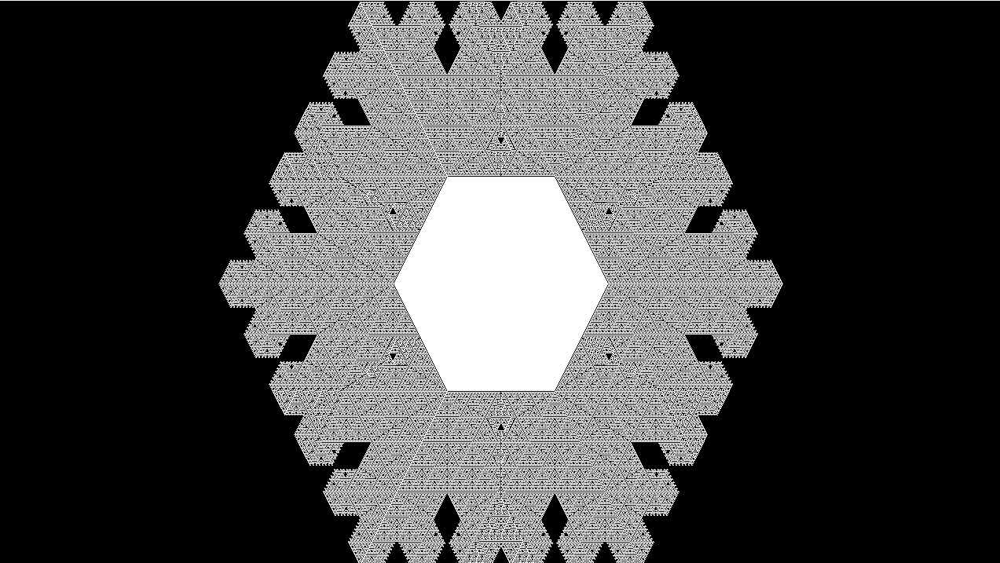

# Sprawozdanie z listy 7 - Klastry
# Mateusz Wojteczek


## Wstęp

Celem niniejszej listy zadań jest zbadanie różnych typów klastrów, ich wzrostu oraz charakterystyk w kontekście modelu Edena, klastrów DLA oraz płatków śniegu. Badanie tych modeli ma istotne znaczenie w wielu dziedzinach nauki, takich jak fizyka, biologia i chemia, ponieważ klastery mogą opisywać szeroki zakres zjawisk naturalnych i procesów.

## Zadanie 1
### Kod programu

```python
import pygame
import numpy as np
import random
import matplotlib.pyplot as plt

class Cell:
    def __init__(self, x, y):
        self.position = pygame.math.Vector2(x, y)
        self.free_sides = []

def initialize(size):
    matrix = np.zeros((size, size), dtype=bool)
    start_pos = size // 2
    matrix[start_pos, start_pos] = True
    initial_cell = Cell(start_pos, start_pos)
    return matrix, [initial_cell]

def update_free_sides(cell, matrix, size):
    directions = [(-1, 0), (1, 0), (0, -1), (0, 1)]
    sides = [4, 2, 3, 1]
    x, y = int(cell.position.x), int(cell.position.y)
    cell.free_sides = [sides[i] for i, (dx, dy) in enumerate(directions)
                       if matrix[(x + dx) % size, (y + dy) % size] == 0]

def grow_cluster(living_cells, matrix, size):
    while True:
        parent_cell = random.choice(living_cells)
        update_free_sides(parent_cell, matrix, size)
        if parent_cell.free_sides:
            break
    side = random.choice(parent_cell.free_sides)
    dx, dy = {1: (0, 1), 2: (1, 0), 3: (0, -1), 4: (-1, 0)}[side]
    new_x, new_y = (int(parent_cell.position.x + dx) % size, int(parent_cell.position.y + dy) % size)
    new_cell = Cell(new_x, new_y)
    living_cells.append(new_cell)
    matrix[new_x, new_y] = True

def calculate_radius(matrix):
    active_cells = np.argwhere(matrix)
    if len(active_cells) == 0:
        return 0
    centroid = np.mean(active_cells, axis=0)
    distances = np.linalg.norm(active_cells - centroid, axis=1)
    return np.mean(distances)

def main():
    pygame.init()
    size = 301
    screen_size = 1000
    screen = pygame.display.set_mode([screen_size, screen_size])
    pygame.display.set_caption('Eden Model Simulation')

    matrix, living_cells = initialize(size)
    num_cells_list = [100, 500, 1000, 5000, 10000, 20000]
    radii = []

    running = True
    clock = pygame.time.Clock()
    cell_count = 1  # Start with the initial cell

    while running:
        # Grow the cluster in batches to reduce rendering frequency
        for _ in range(100):
            if cell_count >= num_cells_list[-1]:
                running = False
                break
            grow_cluster(living_cells, matrix, size)
            cell_count += 1
            if cell_count in num_cells_list:
                radius = calculate_radius(matrix)
                radii.append(radius)
                print(f'Number of cells: {cell_count}, Radius: {radius:.2f}')

        # Render the current state
        screen.fill((0, 0, 0))
        cell_size = screen_size / size
        for cell in living_cells:
            x, y = int(cell.position.x), int(cell.position.y)
            rect = (cell_size * x, cell_size * y, cell_size, cell_size)
            pygame.draw.rect(screen, (255, 255, 255), rect)

        pygame.display.flip()

        for event in pygame.event.get():
            if event.type == pygame.QUIT:
                running = False

        clock.tick(60)  # Limit the frame rate to 60 FPS

    pygame.quit()

    # Plotting the results
    plt.figure(figsize=(10, 6))
    plt.plot(num_cells_list, radii, 'o-', label='Simulated data')
    plt.xlabel('Number of cells (N)')
    plt.ylabel('Radius (r)')
    plt.title('Eden Cluster Growth')
    plt.legend()
    plt.grid(True)

    # Fitting and plotting the expected scaling law
    num_cells_array = np.array(num_cells_list)
    expected_radii = num_cells_array ** 0.5
    plt.plot(num_cells_list, expected_radii, 'r--', label=r'Expected $r \sim N^{1/2}$')
    plt.legend()

    plt.show()

if __name__ == "__main__":
    main()

```

## Analiza wyników 

Na załączonym wykresie przedstawiono zależność promienia klastra od liczby komórek. Linie przedstawiają zarówno dane z symulacji (linia niebieska), jak i teoretyczne oczekiwania dla skalowania r ~ 𝑁 ^ 1/2 (linia czerwona przerywana).

Obserwujemy, że promień klastra rośnie wraz ze wzrostem liczby komórek, co jest zgodne z teoretycznym modelem.
Zależność promienia od liczby komórek jest zgodna z teoretycznym modelem , co potwierdza poprawność symulacji. Jednakże, wartości promienia są nieco niższe od oczekiwanych wartości teoretycznych.

Model Edena wykazuje charakterystyczne właściwości geometryczne, gdzie promień klastra skaluje się zgodnie z zależnością r ~ 𝑁 ^ 1/2. Wyniki symulacji potwierdzają teoretyczne przewidywania, choć obserwowane promienie są nieco niższe od wartości teoretycznych, co może wynikać z różnych czynników, takich jak ograniczenia symulacji lub efekty krawędziowe. Ogólnie, model Edena jest użytecznym narzędziem do badania wzrostu klastrów.


## Zadanie 2
### Kod programu
```python

import pygame
import numpy as np
import random as rand
import matplotlib.pyplot as plt

class Walker:
    def __init__(self, x, y, w):
        self.where_from = int(w)
        self.x = x
        self.y = y

def initialize(size):
    matrix = np.zeros((size, size), dtype=bool)
    center = size // 2
    matrix[center, center] = True
    return matrix, [[center, center]]

def add_walker(size):
    where_from = rand.randint(1, 4)
    if where_from == 1:
        return Walker(rand.randint(1, size - 1), 1, 1)
    elif where_from == 2:
        return Walker(size - 1, rand.randint(1, size - 1), 2)
    elif where_from == 3:
        return Walker(rand.randint(1, size - 1), size - 1, 3)
    elif where_from == 4:
        return Walker(1, rand.randint(1, size - 1), 4)

def update_walker_position(walker):
    random_walk = rand.randint(0, 1)
    if walker.where_from == 1:
        walker.y += 1
        walker.x += 1 if random_walk == 0 else -1
    elif walker.where_from == 2:
        walker.x -= 1
        walker.y += 1 if random_walk == 0 else -1
    elif walker.where_from == 3:
        walker.y -= 1
        walker.x += 1 if random_walk == 0 else -1
    elif walker.where_from == 4:
        walker.x += 1
        walker.y += 1 if random_walk == 0 else -1

def is_near_cluster(walker, matrix, size):
    x, y = walker.x, walker.y
    return (matrix[(x + 1) % size, y] or
            matrix[x - 1, y] or
            matrix[x, (y + 1) % size] or
            matrix[x, y - 1])

def calculate_radius(DLA):
    xmin = ymin = float('inf')
    xmax = ymax = float('-inf')
    for x, y in DLA:
        if x < xmin:
            xmin = x
        if x > xmax:
            xmax = x
        if y < ymin:
            ymin = y
        if y > ymax:
            ymax = y
    r = (xmax - xmin + ymax - ymin) / 4
    center = ((xmin + xmax) // 2, (ymin + ymax) // 2)
    return r, center

def main():
    size = 301
    screen_size = 1000
    pygame.init()
    screen = pygame.display.set_mode([screen_size, screen_size])
    pygame.display.set_caption('DLA Model Simulation')

    matrix, DLA = initialize(size)
    walkers = []
    cell_amount = 0

    running = True
    clock = pygame.time.Clock()
    
    num_particles_list = [100, 500, 1000, 5000, 10000, 20000]
    radii = []
    
    while running:
        for _ in range(100):  # Batch processing for performance
            walkers.append(add_walker(size))
            for walker in walkers[:]:
                update_walker_position(walker)
                if walker.x < 0 or walker.x >= size or walker.y < 0 or walker.y >= size:
                    walkers.remove(walker)
                    continue
                if is_near_cluster(walker, matrix, size):
                    matrix[walker.x, walker.y] = True
                    DLA.append([walker.x, walker.y])
                    walkers.remove(walker)
                    cell_amount += 1
                    if cell_amount in num_particles_list:
                        radius, center = calculate_radius(DLA)
                        radii.append(radius)
                        print(f'Number of particles: {cell_amount}, Radius: {radius:.2f}')
                    if cell_amount >= num_particles_list[-1]:
                        running = False
                        break
        
        screen.fill((0, 0, 0))
        for x, y in DLA:
            rect = (screen_size / size * x, screen_size / size * y, screen_size / size, screen_size / size)
            pygame.draw.rect(screen, (255, 255, 255), rect)

        if DLA:
            radius, center = calculate_radius(DLA)
            center = (screen_size / size * center[0], screen_size / size * center[1])
            pygame.draw.circle(screen, (255, 0, 0), center, radius * screen_size / size, 2)

        pygame.display.flip()

        for event in pygame.event.get():
            if event.type == pygame.QUIT:
                running = False

        clock.tick(60)

    pygame.quit()

    # Plotting the results
    plt.figure(figsize=(10, 6))
    plt.plot(num_particles_list, radii, 'o-', label='Simulated data')
    plt.xlabel('Number of particles (N)')
    plt.ylabel('Radius (r)')
    plt.title('DLA Cluster Growth')
    plt.legend()
    plt.grid(True)

    # Fitting and plotting the expected scaling law
    num_particles_array = np.array(num_particles_list)
    expected_radii = num_particles_array ** (1 / 1.7)
    plt.plot(num_particles_list, expected_radii, 'r--', label=r'Expected $r \sim N^{1/1.7}$')
    plt.legend()

    plt.show()

if __name__ == "__main__":
    main()

```

## Analiza wyników 


Na załączonym wykresie przedstawiono zależność promienia klastra od liczby cząsteczek. Linie przedstawiają zarówno dane z symulacji (linia niebieska), jak i teoretyczne oczekiwania dla skalowania 𝑁 ^ 1/1.7 (linia czerwona przerywana).

Obserwujemy, że promień klastra rośnie wraz ze wzrostem liczby cząsteczek, co jest zgodne z teoretycznym modelem.
Zależność promienia od liczby cząsteczek w danych symulacyjnych pokazuje zgodność z modelem teoretycznym, jednakże, wartości promienia są niższe niż oczekiwane wartości teoretyczne, co może być wynikiem różnych czynników, podobnie zresztą jak w zadaniu poprzednim.

Model DLA wykazuje fraktalną strukturę, gdzie promień klastra skaluje się z liczbą cząsteczek zgodnie z zależnością r ~ 𝑁 ^ 1/1.7.Wyniki symulacji potwierdzają teoretyczne przewidywania, choć obserwowane promienie są niższe od wartości teoretycznych, co może wynikać z ograniczeń symulacji i efektywności procesu dyfuzji w ograniczonej przestrzeni.

## Zadanie 3
### Kod programu
```cpp
#define OLC_PGE_APPLICATION
#include "olcPixelGameEngine.h"

const int W = 1280;
const int H = 720;
int stan[2][W][H];

class Platek : public olc::PixelGameEngine
{
public:
    Platek()
    {
        sAppName = "Wzrost płatka śniegu";
        t = 0;
        c = 0;
        init(c);
        pause = 0;
        rule = 0;
    }

    bool OnUserCreate() override
    {
        return true;
    }

    void init(int _c)
    {
        // Resetowanie stanu
        for (int i = 0; i < W; i++)
            for (int j = 0; j < H; j++)
            {
                stan[_c][i][j] = stan[1 - _c][i][j] = 0;
            }

        // Inicjalizacja początkowego płatka w centrum
        stan[_c][W / 2][H / 2] = stan[1 - _c][W / 2][H / 2] = 1;
    }

    void platek(int _c, int rule)
    {
        // Zmienne pomocnicze dla indeksów sąsiadów
        int ip, im, jp, jm;

        for (int i = 0; i < W; i++)
        {
            for (int j = 0; j < H; j++)
            {
                ip = (i + 1) % W;
                im = (i - 1 + W) % W;
                jp = (j + 1) % H;
                jm = (j - 1 + H) % H;

                int s1, s2, s3, s4, s5, s6;
                int p = j % 2; // parzysty wiersz
                if (p == 0)
                {
                    s1 = stan[_c][ip][j];
                    s2 = stan[_c][ip][jp];
                    s3 = stan[_c][i][jp];
                    s4 = stan[_c][im][j];
                    s5 = stan[_c][i][jm];
                    s6 = stan[_c][ip][jm];
                }
                else
                {
                    s1 = stan[_c][ip][j];
                    s2 = stan[_c][i][jp];
                    s3 = stan[_c][im][jp];
                    s4 = stan[_c][im][j];
                    s5 = stan[_c][im][jm];
                    s6 = stan[_c][i][jm];
                }

                int sum = s1 + s2 + s3 + s4 + s5 + s6;

                bool grow = false;
                switch (rule)
                {
                    case 0:
                        grow = (sum == 1);
                        break;
                    case 1:
                        grow = (sum == 2);
                        break;
                    case 2:
                        grow = (sum > 0);
                        break;
                    case 3:
                        grow = (sum % 3 == 0 && sum > 0); // Dodatkowa zasada: wzrost dla sumy sąsiadów podzielnej przez 3, ale większej od 0
                        break;
                }

                if (!stan[_c][i][j] && grow)
                {
                    if (i <= 0 || i >= W - 1 || j <= 0 || j >= H - 1)
                        pause = 1;

                    stan[1 - _c][i][j] = 1;
                }
                else if (stan[_c][i][j])
                {
                    stan[1 - _c][i][j] = 1;
                }
            }
        }
    }

    bool OnUserUpdate(float fElapsedTime) override
    {
        t += fElapsedTime;

        Clear(olc::Pixel(0, 0, 0));

        if (GetKey(olc::Key::ESCAPE).bPressed)
            exit(0);

        if (GetKey(olc::Key::SPACE).bPressed)
        {
            init(c);
            pause = 0;
        }

        if (GetKey(olc::Key::K1).bPressed)
            rule = 0;
        if (GetKey(olc::Key::K2).bPressed)
            rule = 1;
        if (GetKey(olc::Key::K3).bPressed)
            rule = 2;
        if (GetKey(olc::Key::K4).bPressed)
            rule = 3; // Dodatkowa zasada

        // Rysowanie stanu automatu komórkowego
        for (int j = 0; j < H; j++)
            for (int i = 0; i < W; i++)
            {
                int r, g, b;

                r = g = b = stan[c][i][j] * 255;
                Draw(i, j, olc::Pixel(r, g, b));
            }

        if (!pause)
        {
            platek(c, rule);
            c = 1 - c;
        }
        return true;
    }

private:
    float t;
    int c;
    int pause;
    int rule;
};

int main()
{
    Platek demo;
    if (demo.Construct(W, H, 1, 1))
        demo.Start();

    return 0;
}

```

## Analiza wyników 


Wzrost dla 1 sąsiada:
Ten wariant prowadzi do bardzo rozgałęzionych i chaotycznych struktur. Komórki rosną szybko, prowadząc do formowania się nieregularnych kształtów. Struktura jest gęsta, z licznymi pętlami i przejściami.


Wzrost dla 2 sąsiadów:
W tym wariancie, struktura jest bardziej uporządkowana i symetryczna. Komórki rosną wolniej, co prowadzi do bardziej regularnych wzorów przypominających klasyczne kształty płatków śniegu. Każda gałąź jest dobrze zdefiniowana, a całość wygląda na bardziej harmonijną.



Wzrost dla dowolnej liczby sąsiadów:
Ten wariant powoduje bardzo szybki wzrost komórek, co prowadzi do rozproszonej i rzadkiej struktury. Komórki rosną bez ograniczeń, tworząc luźną siatkę. Wzór jest mniej zdefiniowany i mniej przypomina klasyczny płatek śniegu.


Nowa zasada: wzrost, gdy suma sąsiadów jest podzielna przez 3:
Zastosowanie tej nowej zasady prowadzi do ciekawych, fraktalnych wzorów. Struktura jest bardziej złożona, a wzory są symetryczne i przypominają naturalne płatki śniegu, ale z dodatkowym poziomem złożoności. Wzór pokazuje, jak zmiana prostych zasad lokalnych może prowadzić do powstawania interesujących i estetycznych kształtów.

### Podsumowanie
Przeprowadzone symulacje pokazują, że lokalne zasady wzrostu mają kluczowy wpływ na globalne właściwości formowanych klastrów płatków śniegu. Proste zmiany w regułach wzrostu mogą prowadzić do różnorodnych i złożonych wzorów. Wyniki te ilustrują, jak różne zasady lokalne mogą prowadzić do powstawania zarówno regularnych, jak i chaotycznych struktur. Symulacje te są wartościowym narzędziem do badania procesów samoorganizacji i wzrostu w systemach biologicznych i fizycznych.

## Wnioski
W ramach Listy 7 udało się przeprowadzić szereg symulacji i analiz modelujących różnorodne scenariusze związane ze wzrostem klastrów i ewolucją płatków śniegu. Zadania te pozwoliły na głębsze zrozumienie dynamiki systemów wielocząsteczkowych oraz procesów formowania się złożonych struktur. Wyniki wskazują, że lokalne zasady wzrostu mają kluczowy wpływ na globalne właściwości formowanych klastrów i mogą prowadzić do powstawania zarówno regularnych, jak i chaotycznych struktur.

Każde zadanie dostarczyło wartościowych danych, które pomogły zilustrować kluczowe koncepcje teoretyczne, takie jak zależność promienia klastra od liczby cząsteczek, wpływ wymiarowości na zachowanie systemów oraz zmiany w strukturze płatków śniegu przy różnych zasadach wzrostu. Przeanalizowane modele stanowią solidną bazę do dalszych badań i zastosowań w różnych dziedzinach nauki, od fizyki po inżynierię.