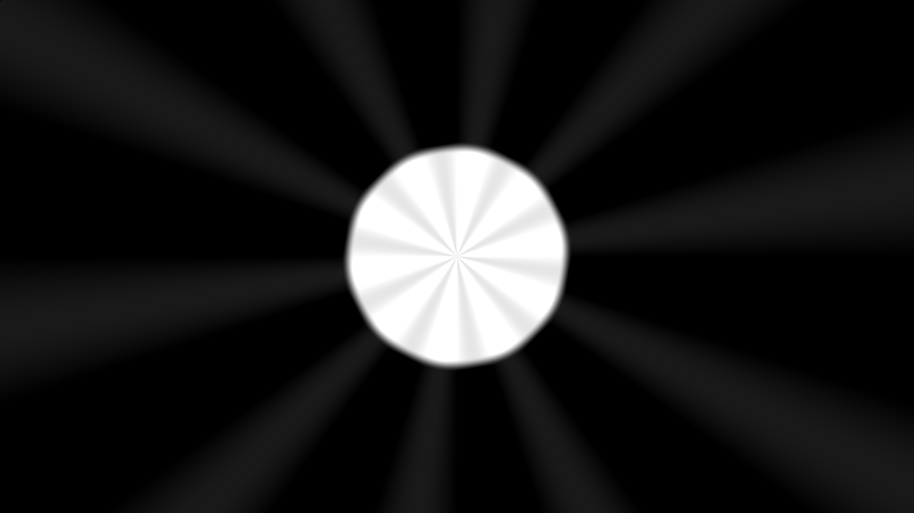

# Sprawozdanie z listy 8 - ShaderToy
# Mateusz Wojteczek


## Wstęp

Celem niniejszej listy zadań było zapoznanie się z podstawami programowania shaderów w środowisku ShaderToy. Zadania obejmowały manipulacje kolorami, transformacje przestrzenne, dekompozycję kąta oraz bardziej zaawansowane techniki takie jak ray marching. Wszystkie zadania mają na celu lepsze zrozumienie grafiki komputerowej i technik renderowania w czasie rzeczywistym.


## Zadanie 1: Distance 2D
### Punkt 9
#### Kod programu

```c++
void mainImage( out vec4 fragColor, in vec2 fragCoord )
{   
    vec2 q = fragCoord.xy / iResolution.xy;
    
    vec2 p = (-1.0 + 2.0 * q) * vec2(iResolution.x / iResolution.y, 1.0);
    
    float d = length(p - vec2(0.0, 0.0));
    
    d = smoothstep(0.55, 0.6, 1.0 - d);

    // Time varying pixel color
    vec3 col = vec3(d, d, d);
    
    // Output to screen
    fragColor = vec4(col,1.0);
}

```

## Analiza wyników 

Koło z wygładzonymi brzegami, co potwierdza poprawność zastosowania funkcji smoothstep.

## Punkt 10
### Kod programu

```c++
void mainImage( out vec4 fragColor, in vec2 fragCoord )
{
    vec2 q = fragCoord.xy / iResolution.xy;
    vec2 p = (-1.0 + 2.0 * q) * vec2(iResolution.x / iResolution.y, 1.0);
    float d = length(p - vec2(0.0, 0.0));
    d = smoothstep(0.55, 0.6, d);
    float phi = atan(p.y, p.x);
    vec3 col = vec3(d, d, d);
    fragColor = vec4( col, 1.0 );
}


```

## Punkt 11
### Kod programu

```c++
void mainImage( out vec4 fragColor, in vec2 fragCoord )
{   
    vec2 q = fragCoord.xy / iResolution.xy;
    
    vec2 p = (-1.0 + 2.0 * q) * vec2(iResolution.x / iResolution.y, 1.0);
    
    float d = length(p - vec2(0.0, 0.0));
    
    d = smoothstep(0.55, 0.6, 1.0 - d);
    
    float phi = atan(p.y,p.x);
    
    d+= sin(phi * 10.0) * 0.1;

    // Time varying pixel color
    vec3 col = vec3(d, d, d);
    
    // Output to screen
    fragColor = vec4(col,1.0);
}

```

## Analiza wyników 

Wzór sinusoidalny widoczny na ekranie, co potwierdza poprawność modyfikacji wartości "d".

## Punkt 12
### Kod programu

```c++
void mainImage( out vec4 fragColor, in vec2 fragCoord )
{
    vec2 q = fragCoord.xy / iResolution.xy;
    vec2 p = (-1.0 + 2.0 * q) * vec2(iResolution.x / iResolution.y, 1.0);
    float d = length(p - vec2(0.0, 0.0));
    d = smoothstep(0.55, 0.6, d);
    float phi = atan(p.y, p.x);
    d += sin(phi * 10.0 + iTime * 0.55) * 0.1;
    vec3 col = vec3(d, d, d);
    fragColor = vec4( col, 1.0 );
}

```

## Analiza wyników 
W folderze z zadaniem można znaleźć plik wideo prezentujący obracający się wzór sinusoidalny, co potwierdza poprawność implementacji animacji.

# Zadanie 2: Deformation
### Punkt 12
#### Kod programu

```c++
void mainImage(out vec4 fragColor, in vec2 fragCoord) {
    // Normalizowanie współrzędnych pikseli do zakresu [0,1]
    vec2 p = fragCoord.xy / iResolution.xy;
    
    // Normalizowanie współrzędnych myszki do zakresu [0,1]
    vec2 mouse = iMouse.xy / iResolution.xy;
    
    // Obliczenie odległości od środka ekranu, przemnożenie przez 10 i dodanie 0.5
    float d = length(p - 0.5) * 10.0 + 0.5;
    
    // Obliczenie kąta (phi) od środka ekranu
    float phi = atan(p.y - 0.5, p.x - 0.5);
    
    // Modyfikacja odległości na podstawie kąta, tworzenie falowego efektu
    float dp = 2.0 + 1.0 * sin(phi * 6.0);
    d = d + dp;
    
    // Skalowanie współrzędnych tekstury względem zmodyfikowanej odległości d i dodanie przesunięcia myszki
    vec2 uv = p / d + mouse;
    
    // Pobranie koloru z tekstury na podstawie nowych współrzędnych i skalowanie koloru względem d
    vec3 col = texture(iChannel0, uv).rgb * 2.0 / d;
    
    // Ustawienie koloru fragmentu
    fragColor = vec4(col, 1.0);
}
```

## Analiza wyników 
Tekstura zmienia się poprawnie w zależności od kąta, co potwierdza poprawność implementacji. Można to zauważyć na filmie zapisanym w folderze.

### Punkt 13
#### Kod programu
```c++
void mainImage(out vec4 fragColor, in vec2 fragCoord) {
    // Normalizowanie współrzędnych pikseli do zakresu [0,1]
    vec2 p = fragCoord.xy / iResolution.xy;
    
    // Normalizowanie współrzędnych myszki do zakresu [0,1]
    vec2 mouse = iMouse.xy / iResolution.xy;
    
    // Obliczenie odległości od środka ekranu, przemnożenie przez 10 i dodanie 0.5
    float d = length(p - 0.5) * 10.0 + 0.5;
    
    // Obliczenie kąta (phi) od środka ekranu
    float phi = atan(p.y - 0.5, p.x - 0.5);
    
    // Modyfikacja odległości na podstawie kąta, tworzenie falowego efektu
    float dp = 2.0 + 1.0 * sin(phi * 6.0);
    d = d + dp;
    
    // Przesunięcie współrzędnych tak, aby środek (0,0) był w środku, skalowanie względem d, dodanie przesunięcia myszki
    vec2 uv = (p - 0.5) / d + mouse;
    
    // Pobranie koloru z tekstury na podstawie nowych współrzędnych i skalowanie koloru względem d
    vec3 col = texture(iChannel0, uv).rgb * 2.0 / d;
    
    // Ustawienie koloru fragmentu
    fragColor = vec4(col, 1.0);
}
```
## Analiza wyników 
Przesunięcie współrzędnych tak, aby środek (0,0) był w środku, poza tym bez zmian.

# Zadanie 3: RayMarching
### Punkt 5
#### Kod programu
```cpp
#ifdef GL_ES
precision mediump float; // Określenie precyzji dla typów zmiennoprzecinkowych w OpenGL ES
#endif

// Funkcja zwracająca odległość od punktu p do powierzchni sfery o promieniu s
float sdSphere(vec3 p, float s) {
    return length(p) - s;
}

// Funkcja zwracająca odległość od punktu p do powierzchni torusa o promieniach określonych w wektorze t
float sdTorus(vec3 p, vec2 t) {
    vec2 q = vec2(length(p.xy) - t.x, p.z);
    return length(q) - t.y;
}

// Funkcja obracająca punkt p o kąt angle wokół osi Y
vec3 rotateY(vec3 p, float angle) {
    float c = cos(angle);
    float s = sin(angle);
    return vec3(c * p.x - s * p.z, p.y, s * p.x + c * p.z);
}

// Funkcja obliczająca pozycję sfery w zależności od czasu
vec3 getSpherePosition(float time) {
    return vec3(0.0, 0.0, sin(time) * 2.0);
}

// Funkcja interpolująca rozmiar sfery w zależności od odległości
float getSphereSize(float distance) {
    return mix(0.1, 0.5, 1.0 - clamp(distance / 5.0, 0.0, 1.0));
}

// Funkcja mapująca scenę, zwracająca najmniejszą odległość i typ materiału
vec2 map(vec3 pos, float time) {
    vec3 spherePos = getSpherePosition(time);
    float sphereSize = getSphereSize(length(pos - spherePos));
    float sphereDist = sdSphere(pos - spherePos, sphereSize);
    float torusDist = sdTorus(rotateY(pos, time * 2.0), vec2(1.0, 0.25)); // Obrót torusa
    return vec2(min(sphereDist, torusDist), sphereDist < torusDist ? 1.0 : 2.0);
}

// Funkcja obliczająca normalną w danej pozycji
vec3 calculateNormal(vec3 pos, float time) {
    vec2 e = vec2(0.001, 0.0);
    vec3 n;
    n.x = map(pos + e.xyy, time).x - map(pos - e.xyy, time).x;
    n.y = map(pos + e.yxy, time).x - map(pos - e.yxy, time).x;
    n.z = map(pos + e.yyx, time).x - map(pos - e.yyx, time).x;
    return normalize(n);
}

// Funkcja obliczająca cień
float shadow(vec3 ro, vec3 rd, float tmin, float tmax, float time) {
    float res = 1.0;
    float t = tmin;
    for (int i = 0; i < 50; i++) {
        float h = map(ro + rd * t, time).x;
        if (h < 0.001) {
            return 0.0;
        }
        res = min(res, 10.0 * h / t);
        t += h;
        if (t > tmax) {
            break;
        }
    }
    return res;
}

// Funkcja cieniująca obiekt
vec3 shade(vec3 pos, vec3 normal, float material, float time) {
    vec3 lightPos = vec3(2.0, 2.0, 2.0); // Pozycja źródła światła
    vec3 lightDir = normalize(lightPos - pos); // Kierunek światła
    float diff = max(dot(normal, lightDir), 0.0); // Obliczenie oświetlenia dyfuzyjnego

    vec3 color;
    if (material == 1.0) {
        color = vec3(1.0, 0.0, 0.0); // Czerwony dla sfery
    } else {
        color = vec3(1.0, 1.0, 1.0); // Biały dla torusa
    }
    
    float shadowFactor = shadow(pos + normal * 0.001, lightDir, 0.01, 2.5, time); // Obliczenie cienia
    
    vec3 ambient = 0.2 * color; // Składowa ambient
    vec3 diffuse = diff * color * shadowFactor; // Składowa dyfuzyjna
    
    return ambient + diffuse; // Zwrócenie koloru z uwzględnieniem cienia
}

// Główna funkcja renderująca obraz
void mainImage(out vec4 fragColor, in vec2 fragCoord) {
    vec2 uv = fragCoord / iResolution.xy * 2.0 - 1.0; // Normalizacja współrzędnych fragmentu
    uv.x *= iResolution.x / iResolution.y; // Kompensacja proporcji ekranu
    
    vec3 ro = vec3(0.0, 0.0, 5.0); // Początkowa pozycja kamery
    vec3 rd = normalize(vec3(uv, -1.0)); // Kierunek promienia
    
    float t = 0.0;
    vec2 res;
    for (int i = 0; i < 100; i++) {
        vec3 pos = ro + rd * t; // Obliczenie pozycji na promieniu
        res = map(pos, iTime); // Mapowanie sceny
        if (res.x < 0.001) break; // Jeśli trafimy na powierzchnię, przerywamy
        t += res.x;
    }
    
    vec3 color = vec3(0.5); // Kolor tła ustawiony na szary
    if (res.x < 0.001) {
        vec3 pos = ro + rd * t;
        vec3 normal = calculateNormal(pos, iTime); // Obliczenie normalnej
        color = shade(pos, normal, res.y, iTime); // Cieniowanie
    }
    
    fragColor = vec4(color, 1.0); // Ustawienie koloru fragmentu
}

```

## Analiza wyników 
Model 3D składający się z torusa oraz kuli renderuje się poprawnie, co potwierdza poprawność implementacji, jak można zauważyć na filmie.

## Wnioski
W ramach niniejszej listy zadań udało się zrealizować szereg ćwiczeń, które pomogły w zrozumieniu podstawowych i bardziej zaawansowanych technik programowania shaderów w środowisku ShaderToy. Zadania te pozwoliły na lepsze zrozumienie manipulacji kolorami, transformacji przestrzennych oraz technik renderowania 3D.

Każde zadanie dostarczyło wartościowych danych, które pomogły zilustrować kluczowe koncepcje teoretyczne. Symulacje te są wartościowym narzędziem do badania procesów grafiki komputerowej i mogą być używane w różnych dziedzinach nauki i inżynierii.